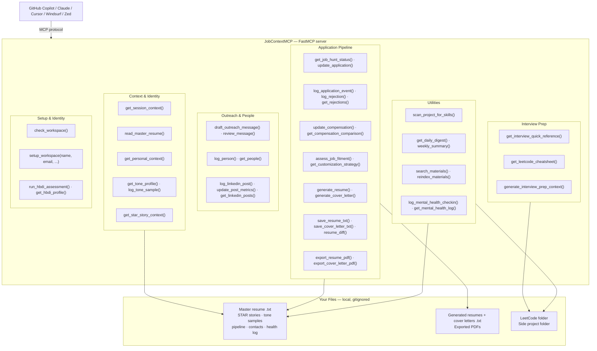
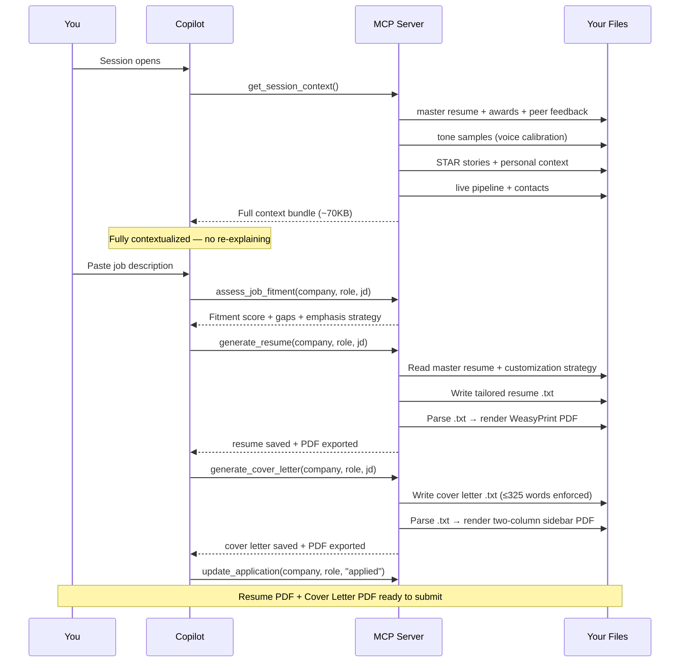

<p align="center">
  
</p>

# JobContextMCP

A personal [Model Context Protocol (MCP)](https://modelcontextprotocol.io/) server that gives GitHub Copilot, Claude, Cursor, Windsurf, Zed, and other MCP-compatible AI assistants persistent, structured memory of your job search — so you never have to re-explain your resume, pipeline status, or interview prep from scratch.

Built in Python using [FastMCP](https://github.com/jlowin/fastmcp).

---

## Output

| Resume | Cover Letter |
|--------|-------------|
|  |  |

Generated from plain `.txt` files — no design tools, no Canva, no InDesign. The templates live in `templates/` and render via WeasyPrint.

---

## The Problem It Solves

Every new AI chat session starts with zero context. During an active job hunt you're constantly re-explaining:
- Which companies you're interviewing at and what stage you're in
- What your top resume bullets and STAR stories are
- Which problems you've practiced and which algorithm patterns you need to review
- How you're feeling today (if you track mental health alongside productivity)

This MCP server solves that by giving any AI assistant a set of tools it can call to retrieve all of that context instantly.

---

## Architecture



### End-to-End: Job Description → Submitted Application



---

## Tools

| Tool | Purpose |
|------|---------|
| `get_job_hunt_status()` | Full pipeline — all active applications, contacts, next steps |
| `update_application(company, role, status, ...)` | Add or update an application |
| `read_master_resume()` | Your master resume (source of truth for all customizations) |
| `list_existing_materials(company?)` | List generated resumes + cover letters |
| `read_existing_resume(filename)` | Read a specific resume file |
| `read_reference_file(filename)` | Read from a reference materials folder |
| `assess_job_fitment(company, role, jd)` | Packages your resume + JD for AI fitment analysis |
| `get_customization_strategy(role_type)` | Resume emphasis guide by role type |
| `get_interview_quick_reference()` | STAR stories + system design framework on demand |
| `get_leetcode_cheatsheet(section?)` | Algorithm patterns — full cheatsheet or by topic |
| `generate_interview_prep_context(company, role, stage)` | Structured context for AI-generated prep docs |
| `get_existing_prep_file(company)` | Read any existing prep file for a company |
| `scan_project_for_skills()` | Scan a side-project repo for resume-worthy skills |
| `log_mental_health_checkin(mood, energy, ...)` | Log a mood/energy entry |
| `get_mental_health_log(days?)` | Recent check-in history with trend summary |
| `search_materials(query, category?)` | **RAG** — semantic search across all indexed materials |
| `reindex_materials()` | **RAG** — (re)build the semantic search index |
| `log_personal_story(story, tags, people?, title?)` | **v3** — log a personal story or memory for context-rich writing |
| `get_personal_context(tag?, person?)` | **v3** — retrieve stories filtered by tag or person |
| `ingest_anecdote(story, tags, title?, people?, tone_sample?)` | **v5.2** — single-call bundler: logs to personal context, optionally ingests as tone sample (≥40 words), and reports STAR tag matches |
| `log_tone_sample(text, source, context?)` | **v3** — ingest a writing sample to teach the AI your voice |
| `get_tone_profile()` | **v3** — retrieve all tone samples before drafting communications |
| `scan_materials_for_tone(category?)` | **v3** — auto-scan resumes/cover letters/prep files and index new tone samples |
| `get_star_story_context(tag, company?, role_type?)` | **v3** — retrieve STAR stories, metric bullets, and company-specific framing hints |
| `draft_outreach_message(contact, company, context, message_type?)` | **v4** — package tone profile, personal context, and writing instructions for AI-drafted outreach |
| `export_resume_pdf(filename, footer_tag?, output_filename?)` | **v4** — parse a .txt resume and render it to PDF |
| `export_cover_letter_pdf(filename, output_filename?)` | **v4** — parse a .txt cover letter and render it to PDF with two-column sidebar |
| `generate_resume(company, role, job_description, output_filename?)` | **v4.1** — generate tailored resume via OpenAI API (or context package for Copilot), auto-save + export PDF |
| `generate_cover_letter(company, role, job_description, output_filename?)` | **v4.1** — generate tailored cover letter, auto-save + export PDF |
| `log_linkedin_post(text, source, context?, posted_date?, url?, hashtags?, links?, title?)` | **v4.8** — store a LinkedIn post with metadata; auto-ingests as tone sample by default |
| `update_post_metrics(post_id?, source?, impressions?, reactions?, ...)` | **v4.8** — update engagement metrics and audience demographics on a stored post |
| `get_linkedin_posts(source?, hashtag?, min_reactions?, include_text?)` | **v4.8** — retrieve posts with filterable aggregate metrics summary |
| `log_rejection(company, role, stage, reason?, notes?, date?)` | **v5** — log a rejection; stored in `data/rejections.json` for pattern analysis |
| `get_rejections(company?, stage?, since?, include_pattern_analysis?)` | **v5** — retrieve rejections with optional filters and stage/reason pattern breakdown |
| `log_application_event(company, role, event_type, notes?)` | **v5** — append an event to an application's immutable event log (phone screen, offer, note, etc.) |
| `get_daily_digest()` | **v5** — morning briefing: overdue follow-ups, stale apps, recent rejections, drafted-not-sent messages, 3 focus priorities |
| `weekly_summary()` | **v5** — 7-day aggregate: new apps, rejections by stage, contacts added, mental health trend |
| `update_compensation(company, role, base?, equity_total?, bonus_target_pct?, level?, ...)` | **v5** — attach comp data (base/equity/bonus) to a tracked application; computes total comp estimate |
| `get_compensation_comparison()` | **v5** — side-by-side comp table for all applications with comp data, sorted by total comp |
| `resume_diff(file_a, file_b)` | **v5** — unified diff between two resume `.txt` files with added/removed line summary |
| `review_message(text)` | **v5** — tone review for outreach drafts: flags corporate phrases, desperation signals, hedging, weak openers, missing CTAs |
| `check_workspace()` | **v0.6** — diagnostic scan: reports present/missing `config.json`, data files, workspace directories, master resume word count, and OpenAI key status |
| `setup_workspace(name, email, phone, linkedin, city_state, master_resume_content, ...)` | **v0.6** — conversational bootstrapper: creates `config.json`, all 7 data files, and resume directories `01–08` from a single chat; idempotent — safe to re-run |
| `run_hbdi_assessment(q1_no_spec_project, q2_critical_feedback, q3_tedious_finish, q4_senior_disagreement, score_a, score_b, score_c, score_d)` | **v0.6** — HBDI cognitive style profiler: scores A/B/C/D quadrants, generates interview framing advice calibrated to your primary style, saves profile to personal context |
| `get_hbdi_profile()` | **v0.6** — retrieve stored HBDI profile with quadrant synthesis and interview framing advice |

---

## Setup

### 1. Clone and install

```bash
git clone https://github.com/YOUR_USERNAME/jobContextMCP
cd jobContextMCP
python3 -m venv .venv
.venv/bin/pip install -r requirements.txt
```

---

### 2. Connect to your AI client

The server speaks [stdio MCP](https://modelcontextprotocol.io/docs/concepts/transports) — it works with any compatible client. Pick yours:

#### VS Code + GitHub Copilot *(recommended — zero extra config)*

`.vscode/mcp.json` is already committed and uses `${workspaceFolder}` relative paths. Once the `.venv` exists and you open this folder in VS Code, the server starts automatically — no extra configuration needed.

> ⚠️ **Do not add the server via the VS Code UI** (the plug icon → "Add MCP Server" flow). This writes a broken entry to your global `~/Library/Application Support/Code/User/mcp.json` using `python` instead of `python3` with no `cwd` — it silently conflicts with the workspace config and causes intermittent tool failures. If tools behave flakily, open that global file and remove any duplicate `jobContextMCP` entry.

> **Multi-root workspaces:** Drop a copy of `.vscode/mcp.json` into any other workspace root (e.g. your Resume folder) and VS Code auto-starts from either window.

#### Claude Desktop

Edit `~/Library/Application Support/Claude/claude_desktop_config.json` (macOS) or `%APPDATA%\Claude\claude_desktop_config.json` (Windows):

```json
{
  "mcpServers": {
    "jobContextMCP": {
      "command": "/absolute/path/to/jobContextMCP/.venv/bin/python3",
      "args": ["/absolute/path/to/jobContextMCP/server.py"],
      "cwd": "/absolute/path/to/jobContextMCP"
    }
  }
}
```

Restart Claude Desktop after saving.

#### Cursor

Add to `.cursor/mcp.json` in this folder (project-scoped) or via **Settings → MCP** (global):

```json
{
  "mcpServers": {
    "jobContextMCP": {
      "command": "/absolute/path/to/.venv/bin/python3",
      "args": ["server.py"],
      "cwd": "/absolute/path/to/jobContextMCP"
    }
  }
}
```

Cursor also reads `.cursorrules` — use `copilot-instructions.example.md` as a starting template.

#### Windsurf

Edit `~/.codeium/windsurf/mcp_config.json`:

```json
{
  "mcpServers": {
    "jobContextMCP": {
      "command": "/absolute/path/to/.venv/bin/python3",
      "args": ["server.py"],
      "cwd": "/absolute/path/to/jobContextMCP"
    }
  }
}
```

Windsurf also reads `.windsurfrules` — same `copilot-instructions.example.md` template applies.

#### Zed

Add to `~/.config/zed/settings.json` under `"context_servers"`:

```json
{
  "context_servers": {
    "jobContextMCP": {
      "command": {
        "path": "/absolute/path/to/.venv/bin/python3",
        "args": ["server.py"],
        "env": {}
      },
      "settings": {}
    }
  }
}
```

---

### 3. First-session setup via chat

Once the server is running, open a chat with your AI assistant and call:

```
check_workspace()
```

This scans for `config.json`, all data files, workspace directories, and reports exactly what needs to be created. On a fresh clone you'll see everything listed as missing.

Then run `setup_workspace()` with your details:

```
setup_workspace(
  name="Your Name",
  email="you@example.com",
  phone="555-867-5309",
  linkedin="www.linkedin.com/in/yourhandle",
  city_state="Your City, ST 00000",
  location="Your Metro Area, ST",
  master_resume_content="<paste your full resume text here>",
  leet_language="Python"
)
```

This single call:
- Creates `config.json` with your contact info and OpenAI key slot
- Initializes all 7 data files (`status.json`, `personal_context.json`, `tone_samples.json`, `rejections.json`, `mental_health_log.json`, `linkedin_posts.json`, `people.json`)
- Creates all 8 resume subdirectories (`01-Current-Optimized` through `08-Interview-Prep-Docs`) inside `workspace/resumes/`
- Saves your master resume `.txt` and creates a LeetCode practice scaffold in `workspace/leetcode/`

`setup_workspace()` is idempotent — safe to re-run if you add new fields or need to recreate a deleted file.

> `config.json` and all files under `data/` are gitignored — your contact info, API key, pipeline data, and personal stories never leave your machine.

---

### 4. (Optional) Run your HBDI cognitive-style assessment

HBDI (Herrmann Brain Dominance Instrument) is a cognitive style profiler built into the server. It saves your primary quadrant profile to `personal_context.json` and generates interview framing advice calibrated to how you naturally think and communicate.

```
run_hbdi_assessment(
  q1_no_spec_project="<one paragraph: how you'd approach a new project with no spec>",
  q2_critical_feedback="<one paragraph: how you respond to critical feedback>",
  q3_tedious_finish="<one paragraph: how you handle finishing tedious work>",
  q4_senior_disagreement="<one paragraph: how you handle disagreeing with a senior engineer>",
  score_a=3,   # Analytical / logical  (1–4)
  score_b=2,   # Sequential / detail   (1–4)
  score_c=3,   # Interpersonal         (1–4)
  score_d=4    # Creative / big-picture (1–4)
)
```

Run `get_hbdi_profile()` any time to retrieve the synthesized report and framing advice.

---

### 5. (Optional) Enable AI generation and RAG search

Add your OpenAI API key to `config.json` (created by `setup_workspace()`):

```json
"openai_api_key": "sk-...",
"openai_model": "gpt-4o-mini"
```

Then build the RAG index:

```bash
.venv/bin/python rag.py
```

This embeds all your materials using `text-embedding-3-small`. Cost is typically under $0.10 for a full index. Once built, `search_materials()` runs locally with no further API calls.


---

## Workspace Structure

This server is designed to run inside a multi-root VS Code workspace — one that includes your resume folder, side projects, and interview prep alongside the server itself. Copilot needs direct access to all of it to be useful.

| Folder | Purpose |
|--------|---------|
| `jobContextMCP/` | This repo — MCP server source, templates, data files |
| `Resume 2025/` | All resumes, cover letters, PDFs, prep docs, reference materials |
| `LeetCodePractice/` | LeetCode solutions, cheatsheets, daily review guides |
| Side projects | Source code for things you built during the job search — see below |

### Why side projects are in the workspace

The server can scan any project you're actively building and surface resume bullets you may not have thought to write yet.

**`scan_project_for_skills()`** *(v4)* — iterates over all folders listed in `side_project_folders` in your `config.json`, reads each codebase, and returns a per-project breakdown of technologies used, patterns applied, and metrics worth calling out on a resume. The loop closes itself: you build something, the server notices what you used, and shows you what to add to your master resume before the interview.

Example: built an IoT camera with servo HAT control, Azure Blob Storage, and systemd service management. The scanner caught all three as resume-worthy additions — none of which made it into the original resume draft.

To add a new project:
```json
"side_project_folders": [
  "/path/to/your/primary-project",
  "/path/to/another-project"
]
```

The `.github/copilot-instructions.md` in each folder tells Copilot to call `get_session_context()` first. With `mcp.json` auto-starting the server, that instruction is immediately actionable — tools are live before the first message.

Data files the server reads at runtime (all resolved relative to `resume_folder` in `config.json`):
- `01-Current-Optimized/` — master source resume + all customized versions
- `02-Cover-Letters/` — cover letter `.txt` files
- `03-Resume-PDFs/` — exported PDFs land here
- `06-Reference-Materials/` — resume template, award citations, peer feedback, skills variants

---

## The System Is Only As Good As What You Feed It

`get_session_context()` loads four things every session: your master resume, your tone profile, your personal context library, and your live pipeline. That's it. It does **not** read individual resumes or cover letters — so anything meaningful that lives only in those files is invisible to the AI until you explicitly extract and log it.

**This is the most common reason the AI produces generic output.** The RAG index can reach your cover letters and resumes via `search_materials()`, but that's reactive — it only surfaces content when the AI knows to ask for it. The personal context library and tone profile are active — they load automatically and inform every draft, every fitment, every outreach message.

### What to ingest before you rely on the system

**1. Scan your existing cover letters and resumes for tone samples**

If you've written previous cover letters, run:

```
scan_materials_for_tone(category="cover_letters", limit=100)
scan_materials_for_tone(category="resumes", limit=100)
```

This indexes your existing writing so the AI can mirror your voice. Do this once after setup, then again whenever you add a batch of new materials.

**2. Log personal stories explicitly**

Cover letters accumulate stories that were written in context and then forgotten — family history, non-linear career paths, motivating experiences, the reason you care about a specific company. These don't index themselves into the personal context library. Read through your best cover letters and call `log_personal_story()` for anything worth keeping. Same goes for non-digital sources: going-away cards, award citations, performance reviews, peer feedback forms.

```
log_personal_story(
    story="Full narrative in your own words...",
    tags=["family", "engineering_philosophy", "ford"],
    title="Short memorable title"
)
```

**3. Ingest peer feedback and recognition awards**

Formal feedback cycles and recognition awards contain peer-sourced, manager-attributed language that is more credible in interviews than anything you write about yourself. Log quotes verbatim with their source and date. Useful tags: `peer_feedback`, `manager_recognition`, `attribution`.

**4. Rebuild the RAG index after adding new files**

Whenever you add new resumes, cover letters, or reference materials to your resume folder, run:

```
reindex_materials()
```

The RAG index is not updated automatically. If you skip this, `search_materials()` won't know about anything added since the last index build.

**5. Scan your side project after any sprint**

```
scan_project_for_skills()
```

Skills picked up during the job search (new frameworks, cloud services, languages) won't appear on your resume until you run this and manually add the suggested bullets to your master resume.

### The ingestion loop

The goal is a library where the AI can answer "what's the most honest, specific, human thing Frank can say about X?" without you having to re-explain it. Stories, quotes, tone examples, and peer feedback are the raw material. The more you put in, the less generic the output.

When in doubt: if something made you proud, surprised a colleague, landed in a card, or earned a recognition — log it.

---

## AI Resume & Cover Letter Generation

`generate_resume()` and `generate_cover_letter()` are end-to-end tools: one call produces a
saved `.txt` + exported PDF. They load the master resume, tone profile, and job-fitment
strategy automatically — no manual context assembly needed.

### With OpenAI key (fully automated)
Add `openai_api_key` (and optionally `openai_model`) to `config.json`:

```json
"openai_api_key": "sk-...",
"openai_model": "gpt-4o-mini"
```

Then call from within Copilot:

```
generate_resume("Stripe", "Senior Software Engineer", "<paste JD>")
generate_cover_letter("Stripe", "Senior Software Engineer", "<paste JD>")
```

Generates content, saves `.txt`, and exports PDF in one shot.
Cost: ~$0.002 per document at `gpt-4o-mini` pricing.

### Without OpenAI key (Copilot-assisted)
If no key is configured, each tool returns a full context package — master resume, tone
profile, customization strategy, and format instructions — and Copilot writes the content
itself, then calls `save_resume_txt` / `export_resume_pdf`.

### System constraints (enforced in the prompt)

**Resume**
- All metrics and achievements must come verbatim from your master resume — no invention.
- Section headers must be ALL CAPS: `PROFESSIONAL EXPERIENCE`, `CORE TECHNICAL SKILLS`, `EDUCATION`, `LEADERSHIP & COMMUNITY`.
- Job header format: `Title | Company, Location | Month YYYY - Month YYYY` (three pipe-delimited parts).
- Bullets must use `•` (Unicode U+2022) — not `-` or `*`.
- Contact block uses labeled fields: `phone:`, `email:`, `linkedin:` (lowercase, colon suffix).
- Target length: 650–800 words (one tight page in Courier New 9.2pt).

**Cover letter**
- Hard max: **325 words** in the letter body.
- Exactly **4 paragraphs** — Para 1: hook + role + company; Para 2: technical achievement + metric; Para 3: second differentiator; Para 4: short closer (1–2 sentences).
- No date, no address block, no Re: line, no company name in the body.
- Salutation: `Dear Hiring Manager,` — no variations.
- No bullets, no bold, no headers inside the body — prose only.

> These constraints are baked into the prompts. Deviations cause PDF rendering errors because the
> templates have fixed dimensions. If you add your own generation logic, copy the format specs
> from `tools/generate.py` (`_RESUME_FORMAT_SPEC`, `_COVER_LETTER_FORMAT_SPEC`).

---

## PDF Template Demo

The repo includes two fake-identity demo files so you can preview the PDF output without using real data:

```bash
# Generate the demo PDFs after setup:
python -c "
from tools.export import export_resume_pdf, export_cover_letter_pdf
export_resume_pdf('Nobody MacFakename Resume - Demo Software Engineer.txt')
export_cover_letter_pdf('Nobody MacFakename Cover Letter - Demo Software Engineer.txt')
"
```

PDFs land in `03-Resume-PDFs/` inside your `resume_folder`. The source `.txt` files are in `01-Current-Optimized/` and `02-Cover-Letters/` respectively.

---

## Data Privacy

`config.json` and all files under `data/` — including `status.json`, `mental_health_log.json`, `personal_context.json`, `tone_samples.json`, `rejections.json`, `people.json`, and `linkedin_posts.json` — are gitignored. Your real application data, personal stories, contact names, rejection history, and health entries never leave your machine.

---

## Roadmap

### v0.6 *(shipped)*

- **`setup_workspace()`** — conversational bootstrapper: creates `config.json`, all 7 data files, `workspace/resumes/` subdirectories `01–08`, and a LeetCode scaffold from a single chat; zero manual JSON editing
- **`check_workspace()`** — diagnostic scan: reports what's present, missing, or misconfigured; run any time files go missing
- **`run_hbdi_assessment()`** — HBDI cognitive style profiler: saves primary/secondary quadrant profile + interview framing advice to personal context
- **`get_hbdi_profile()`** — retrieve stored HBDI profile with quadrant synthesis

### Planned — v0.7

- `get_github_stats(username)` — pull public commit/repo activity to surface in resume bullets and cover letter talking points
- `get_upcoming_interviews(days?)` — filter pipeline to applications with scheduled interviews in the next N days
- `get_referral_chains(company)` — surface contacts who could refer you at a target company
- `draft_reply(company, role, message_type)` — draft a follow-up, thank-you, or counter-offer reply using stored application context and tone profile

---

## Adapting the Side-Project Scanner

`scan_project_for_skills()` scans a project folder for technologies used and suggests new resume bullets. Point `side_project_folder` in `config.json` at whatever you're currently building.

---

## Copilot Instructions Template

Include a `.github/copilot-instructions.md` in your workspace pointing to this MCP server so Copilot knows to call its tools. See `copilot-instructions.example.md` for a starting template.

---

## Updating Dependencies

```bash
.venv/bin/pip install -U "mcp[cli]" "openai" "numpy"
```


