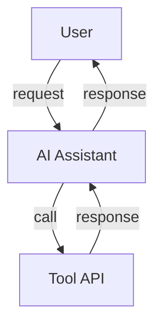
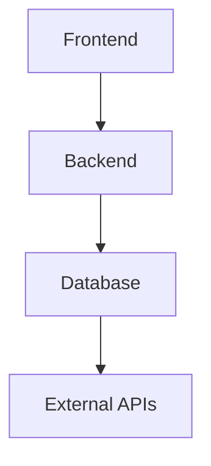
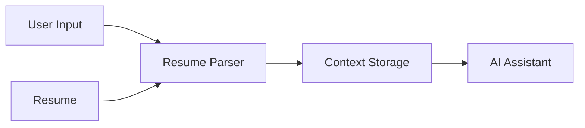
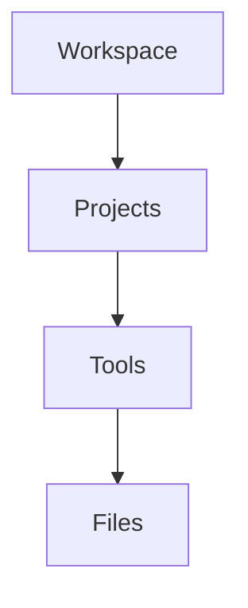
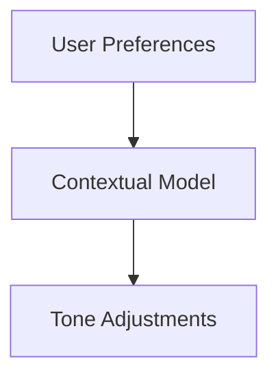
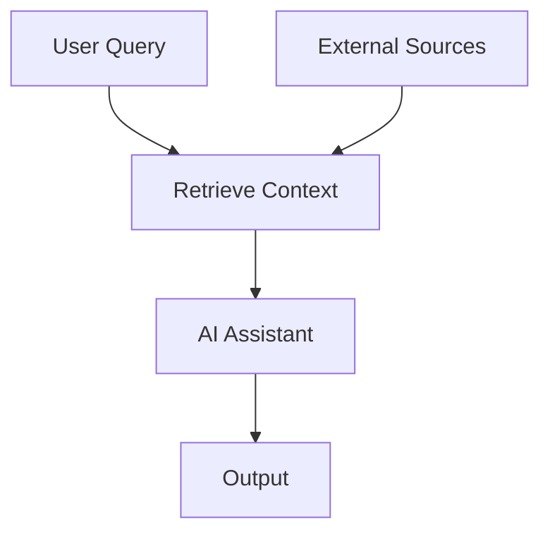

# Job Search MCP

This MCP server solves that by giving any AI assistant a set of tools it can call to retrieve all of that context instantly.

## Architecture

## Tools

Here is a list of tools available in the MCP. 

... (rest of README content)
