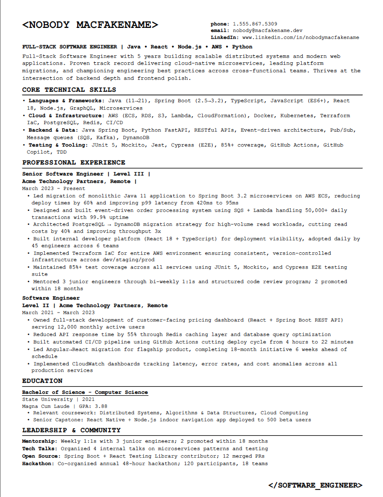
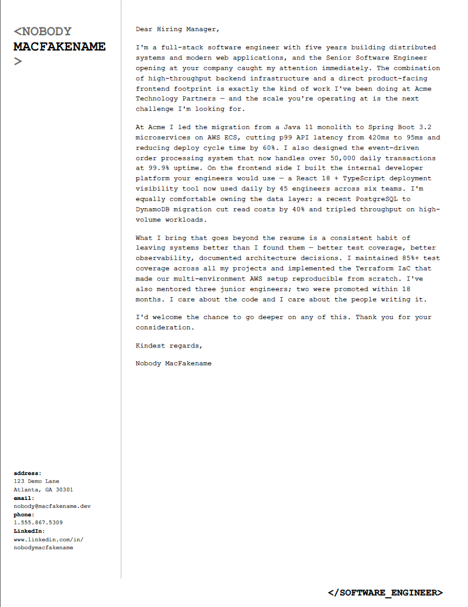
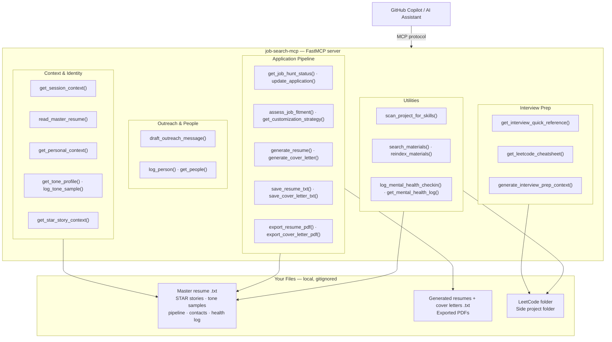
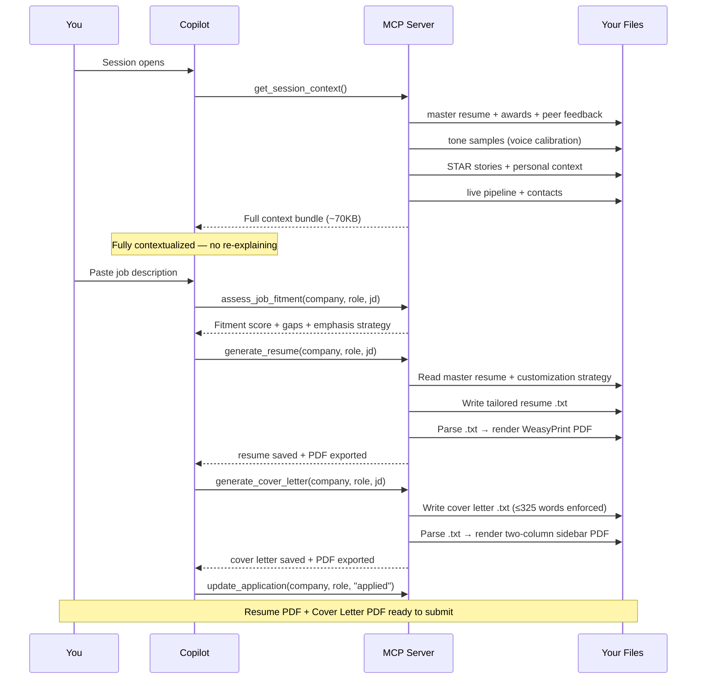

# job-search-mcp

A personal [Model Context Protocol (MCP)](https://modelcontextprotocol.io/) server that gives GitHub Copilot and other MCP-compatible AI assistants persistent, structured memory of your job search — so you never have to re-explain your resume, pipeline status, or interview prep from scratch.

Built in Python using [FastMCP](https://github.com/jlowin/fastmcp).

---

## Output

| Resume | Cover Letter |
|--------|-------------|
|  |  |

Generated from plain `.txt` files — no design tools, no Canva, no InDesign. The templates live in `templates/` and render via WeasyPrint.

---

## The Problem It Solves

Every new AI chat session starts with zero context. During an active job hunt you're constantly re-explaining:
- Which companies you're interviewing at and what stage you're in
- What your top resume bullets and STAR stories are
- Which problems you've practiced and which algorithm patterns you need to review
- How you're feeling today (if you track mental health alongside productivity)

This MCP server solves that by giving any AI assistant a set of tools it can call to retrieve all of that context instantly.

---

## Architecture



### End-to-End: Job Description → Submitted Application



---

## Tools

| Tool | Purpose |
|------|---------|
| `get_job_hunt_status()` | Full pipeline — all active applications, contacts, next steps |
| `update_application(company, role, status, ...)` | Add or update an application |
| `read_master_resume()` | Your master resume (source of truth for all customizations) |
| `list_existing_materials(company?)` | List generated resumes + cover letters |
| `read_existing_resume(filename)` | Read a specific resume file |
| `read_reference_file(filename)` | Read from a reference materials folder |
| `assess_job_fitment(company, role, jd)` | Packages your resume + JD for AI fitment analysis |
| `get_customization_strategy(role_type)` | Resume emphasis guide by role type |
| `get_interview_quick_reference()` | STAR stories + system design framework on demand |
| `get_leetcode_cheatsheet(section?)` | Algorithm patterns — full cheatsheet or by topic |
| `generate_interview_prep_context(company, role, stage)` | Structured context for AI-generated prep docs |
| `get_existing_prep_file(company)` | Read any existing prep file for a company |
| `scan_project_for_skills()` | Scan a side-project repo for resume-worthy skills |
| `log_mental_health_checkin(mood, energy, ...)` | Log a mood/energy entry |
| `get_mental_health_log(days?)` | Recent check-in history with trend summary |
| `search_materials(query, category?)` | **RAG** — semantic search across all indexed materials |
| `reindex_materials()` | **RAG** — (re)build the semantic search index |
| `log_personal_story(story, tags, people?, title?)` | **v3** — log a personal story or memory for context-rich writing |
| `get_personal_context(tag?, person?)` | **v3** — retrieve stories filtered by tag or person |
| `log_tone_sample(text, source, context?)` | **v3** — ingest a writing sample to teach the AI your voice |
| `get_tone_profile()` | **v3** — retrieve all tone samples before drafting communications |
| `scan_materials_for_tone(category?)` | **v3** — auto-scan resumes/cover letters/prep files and index new tone samples |
| `get_star_story_context(tag, company?, role_type?)` | **v3** — retrieve STAR stories, metric bullets, and company-specific framing hints |
| `draft_outreach_message(contact, company, context, message_type?)` | **v4** — package tone profile, personal context, and writing instructions for AI-drafted outreach |
| `export_resume_pdf(filename, footer_tag?, output_filename?)` | **v4** — parse a .txt resume and render it to PDF |
| `export_cover_letter_pdf(filename, output_filename?)` | **v4** — parse a .txt cover letter and render it to PDF with two-column sidebar |
| `generate_resume(company, role, job_description, output_filename?)` | **v4.1** — generate tailored resume via OpenAI API (or context package for Copilot), auto-save + export PDF |
| `generate_cover_letter(company, role, job_description, output_filename?)` | **v4.1** — generate tailored cover letter, auto-save + export PDF |

---

## Setup

### 1. Clone and install

```bash
git clone https://github.com/YOUR_USERNAME/job-search-mcp
cd job-search-mcp
python3 -m venv .venv
.venv/bin/pip install -r requirements.txt
```

### 2. Create your resume folder structure

Create a folder anywhere on your machine (iCloud, Dropbox, local — your choice) with this layout:

```
Your Resume Folder/
├── 01-Current-Optimized/     ← .txt resumes go here
├── 02-Cover-Letters/         ← .txt cover letters go here
├── 03-Resume-PDFs/           ← exported PDFs land here (auto-created)
└── 06-Reference-Materials/   ← master resume, awards, feedback, skills
```

Place your master resume `.txt` file in `01-Current-Optimized/`.

### 3. Configure paths

```bash
cp config.example.json config.json
```

Edit `config.json` with your absolute paths and contact info:

```json
{
  "resume_folder": "/path/to/your/Resume Folder",
  "leetcode_folder": "/path/to/your/LeetCodePractice",
  "side_project_folder": "/path/to/your/side-project",
  "data_folder": "/path/to/job-search-mcp/data",
  "master_resume_path": "01-Current-Optimized/Your Name Resume - MASTER SOURCE.txt",
  "optimized_resumes_dir": "01-Current-Optimized",
  "cover_letters_dir": "02-Cover-Letters",
  "reference_materials_dir": "06-Reference-Materials",
  "openai_api_key": "sk-...",
  "openai_model": "gpt-4o-mini",
  "contact": {
    "name": "YOUR FULL NAME",
    "phone": "555-867-5309",
    "email": "you@example.com",
    "linkedin": "www.linkedin.com/in/yourhandle",
    "address": "123 Your Street",
    "city_state": "Your City, ST 00000"
  }
}
```

> `config.json` is gitignored — your real paths, contact info, and API key never leave your machine.

### 4. Initialize data files

```bash
cp data/status.example.json data/status.json
cp data/mental_health_log.example.json data/mental_health_log.json
cp data/personal_context.example.json data/personal_context.json
cp data/tone_samples.example.json data/tone_samples.json
```

### 5. Connect to VS Code

`.vscode/mcp.json` is committed to this repo. Once the `.venv` exists and you open this folder in VS Code, the server starts automatically — no clicking required.

If you need to adapt the paths for your machine, edit `.vscode/mcp.json`:

```json
{
  "servers": {
    "job-search-as": {
      "type": "stdio",
      "command": "/absolute/path/to/.venv/bin/python3",
      "args": ["/absolute/path/to/server.py"],
      "cwd": "/absolute/path/to/job-search-mcp"
    }
  }
}
```

Then **Cmd+Shift+P → Developer: Reload Window**.

> **Multi-root workspaces:** Drop the same `mcp.json` into `.vscode/` inside any other workspace root (e.g. your Resume folder) and VS Code will auto-start from either window.

### 6. (Optional) Enable AI generation and RAG search

Add your OpenAI API key to `config.json` (already shown in step 3). Then build the RAG index:

```bash
.venv/bin/python rag.py
```

This embeds all your materials using `text-embedding-3-small`. Cost is typically under $0.10 for a full index. Once built, `search_materials()` runs locally with no further API calls.

---

## Workspace Structure

This server is designed to run inside a multi-root VS Code workspace — one that includes your resume folder, side projects, and interview prep alongside the server itself. Copilot needs direct access to all of it to be useful.

| Folder | Purpose |
|--------|---------|
| `job-search-mcp/` | This repo — MCP server source, templates, data files |
| `Resume 2025/` | All resumes, cover letters, PDFs, prep docs, reference materials |
| `LeetCodePractice/` | LeetCode solutions, cheatsheets, daily review guides |
| Side projects | Source code for things you built during the job search — see below |

### Why side projects are in the workspace

The server can scan any project you're actively building and surface resume bullets you may not have thought to write yet.

**`scan_project_for_skills()`** *(v4)* — points at whatever folder is set in `side_project_folder` in your `config.json`, reads the codebase, and returns a list of technologies used, patterns applied, and metrics worth calling out on a resume. The loop closes itself: you build something, the server notices what you used, and shows you what to add to your master resume before the interview.

Example: built an IoT camera with servo HAT control, Azure Blob Storage, and systemd service management. The scanner caught all three as resume-worthy additions — none of which made it into the original resume draft.

To point it at your own project:
```json
"side_project_folder": "/path/to/your/side-project"
```

The `.github/copilot-instructions.md` in each folder tells Copilot to call `get_session_context()` first. With `mcp.json` auto-starting the server, that instruction is immediately actionable — tools are live before the first message.

Data files the server reads at runtime (all resolved relative to `resume_folder` in `config.json`):
- `01-Current-Optimized/` — master source resume + all customized versions
- `02-Cover-Letters/` — cover letter `.txt` files
- `03-Resume-PDFs/` — exported PDFs land here
- `06-Reference-Materials/` — resume template, award citations, peer feedback, skills variants

---

## AI Resume & Cover Letter Generation

`generate_resume()` and `generate_cover_letter()` are end-to-end tools: one call produces a
saved `.txt` + exported PDF. They load the master resume, tone profile, and job-fitment
strategy automatically — no manual context assembly needed.

### With OpenAI key (fully automated)
Add `openai_api_key` (and optionally `openai_model`) to `config.json`:

```json
"openai_api_key": "sk-...",
"openai_model": "gpt-4o-mini"
```

Then call from within Copilot:

```
generate_resume("Stripe", "Senior Software Engineer", "<paste JD>")
generate_cover_letter("Stripe", "Senior Software Engineer", "<paste JD>")
```

Generates content, saves `.txt`, and exports PDF in one shot.
Cost: ~$0.002 per document at `gpt-4o-mini` pricing.

### Without OpenAI key (Copilot-assisted)
If no key is configured, each tool returns a full context package — master resume, tone
profile, customization strategy, and format instructions — and Copilot writes the content
itself, then calls `save_resume_txt` / `export_resume_pdf`.

### System constraints (enforced in the prompt)

**Resume**
- All metrics and achievements must come verbatim from your master resume — no invention.
- Section headers must be ALL CAPS: `PROFESSIONAL EXPERIENCE`, `CORE TECHNICAL SKILLS`, `EDUCATION`, `LEADERSHIP & COMMUNITY`.
- Job header format: `Title | Company, Location | Month YYYY - Month YYYY` (three pipe-delimited parts).
- Bullets must use `•` (Unicode U+2022) — not `-` or `*`.
- Contact block uses labeled fields: `phone:`, `email:`, `linkedin:` (lowercase, colon suffix).
- Target length: 650–800 words (one tight page in Courier New 9.2pt).

**Cover letter**
- Hard max: **325 words** in the letter body.
- Exactly **4 paragraphs** — Para 1: hook + role + company; Para 2: technical achievement + metric; Para 3: second differentiator; Para 4: short closer (1–2 sentences).
- No date, no address block, no Re: line, no company name in the body.
- Salutation: `Dear Hiring Manager,` — no variations.
- No bullets, no bold, no headers inside the body — prose only.

> These constraints are baked into the prompts. Deviations cause PDF rendering errors because the
> templates have fixed dimensions. If you add your own generation logic, copy the format specs
> from `tools/generate.py` (`_RESUME_FORMAT_SPEC`, `_COVER_LETTER_FORMAT_SPEC`).

---

## PDF Template Demo

The repo includes two fake-identity demo files so you can preview the PDF output without using real data:

```bash
# Generate the demo PDFs after setup:
python -c "
from tools.export import export_resume_pdf, export_cover_letter_pdf
export_resume_pdf('Nobody MacFakename Resume - Demo Software Engineer.txt')
export_cover_letter_pdf('Nobody MacFakename Cover Letter - Demo Software Engineer.txt')
"
```

PDFs land in `03-Resume-PDFs/` inside your `resume_folder`. The source `.txt` files are in `01-Current-Optimized/` and `02-Cover-Letters/` respectively.

---

## Data Privacy

`config.json` and all files under `data/` — including `status.json`, `mental_health_log.json`, `personal_context.json`, and `tone_samples.json` — are gitignored. Your real application data, personal stories, contact names, and health entries never leave your machine.

---

## Roadmap

### Workspace Generation Tool *(planned — v0.5)*
A `setup_workspace()` tool that bootstraps a complete job search workspace from scratch via conversational prompts:

- On first run, checks for all required directories and data files.
- Prompts conversationally for missing paths ("Where should resume files go?"), creates folders and starter files with sensible defaults.
- Populates initial data: contacts, tone samples, job pipeline, personal stories — all via chat, no manual JSON editing.
- Self-healing: if a folder or file is later deleted, detects and recreates on next run.
- Target: zero manual config-file editing for onboarding.

Design goal: a non-technical job seeker can clone the repo, open VS Code, and have a fully-configured workspace in under 5 minutes through chat alone.

---

## Adapting the Side-Project Scanner

`scan_project_for_skills()` scans a project folder for technologies used and suggests new resume bullets. Point `side_project_folder` in `config.json` at whatever you're currently building.

---

## Copilot Instructions Template

Include a `.github/copilot-instructions.md` in your workspace pointing to this MCP server so Copilot knows to call its tools. See `copilot-instructions.example.md` for a starting template.

---

## Updating Dependencies

```bash
.venv/bin/pip install -U "mcp[cli]" "openai" "numpy"
```


