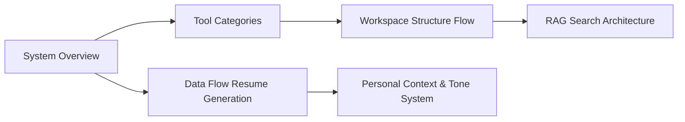

# Job Search MCP

This MCP server solves that by giving any AI assistant a set of tools it can call to retrieve all of that context instantly.

## Architecture

## Tools

Tools overview and descriptions...
