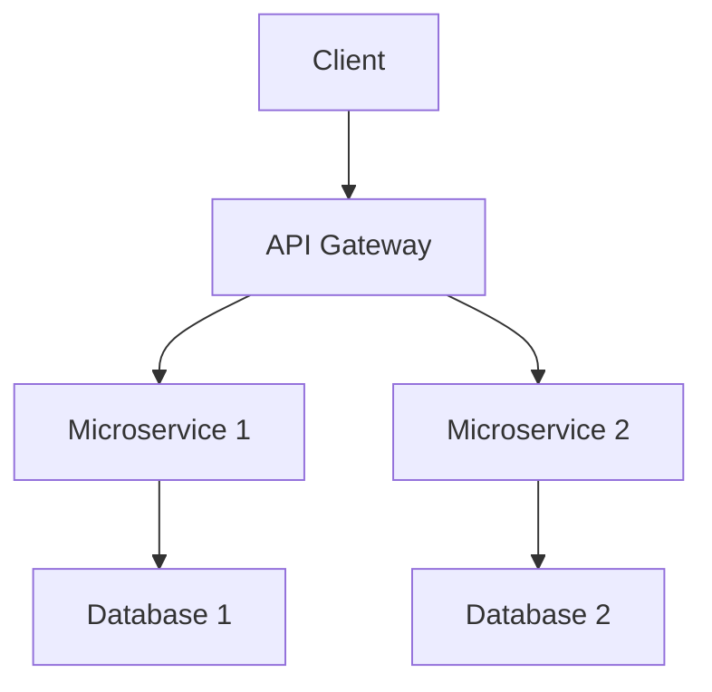
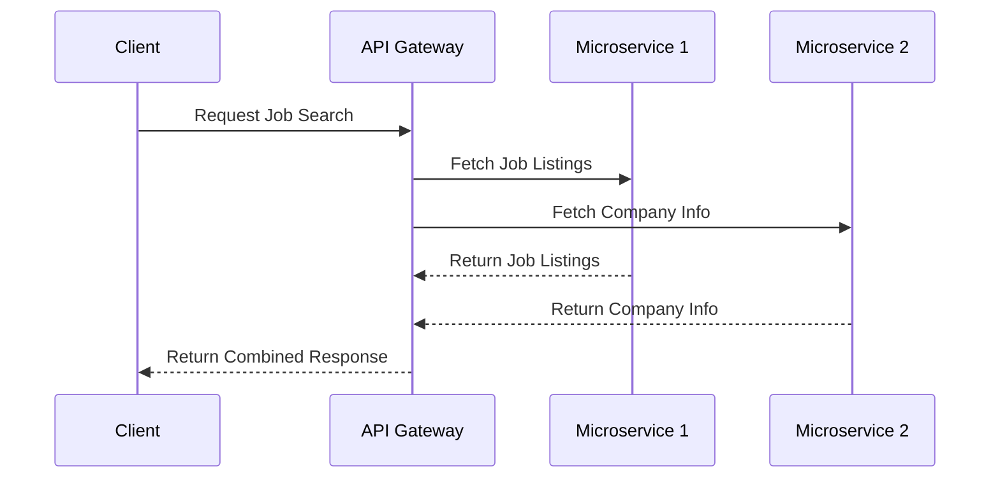
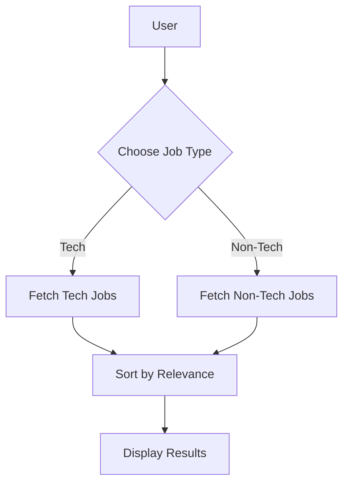

# Job Search MCP

This MCP server solves that by giving any AI assistant a set of tools it can call to retrieve all of that context instantly.

## Architecture





```mermaid
stateDiagram-v2;
    [*] --> Searching;
    Searching --> Results;
    Results --> [*];
    Searching --> NoResults;
    NoResults --> [*];
```



```mermaid
gantt;
    title A Gantt Diagram;
    dateFormat  YYYY-MM-DD;
    section Job Search
    Search Jobs    :active, 2026-02-23, 30d;
    Review Applications :after Search Jobs , 30d;
    Get Interviews       :after Review Applications  , 30d;
```


## Getting Started

### Prerequisites

- Node.js
- npm

### Installation

1. Clone the repository.
2. Run `npm install`.  
3. Run `npm start` to start the server.

## Contributing

Please feel free to submit issues or pull requests to help us improve this project!