<p align="center">
  
</p>

<p align="center">
  
  
  <a href="https://sonarcloud.io/component_measures?id=JustLikeFrank3_jobContextMCP&metric=coverage"></a>
  
  
  
</p>
<p align="center">
  <a href="https://sonarcloud.io/summary/new_code?id=JustLikeFrank3_jobContextMCP"></a>
</p>

# JobContextMCP

A personal [Model Context Protocol (MCP)](https://modelcontextprotocol.io/) server and local dashboard that gives the GitHub Copilot app, GitHub Copilot in VS Code, Claude Desktop, Cursor, Windsurf, Zed, browser/mobile workflows, CLI scripts, and other MCP-compatible or HTTP-capable clients persistent, structured memory of your job search — so you never have to re-explain your resume, pipeline status, interview prep, outreach context, application history, or portfolio metrics from scratch.

Built in Python using [FastMCP](https://github.com/jlowin/fastmcp), FastAPI, SQLite (with dual-write JSON fallback), optional OpenAI/Azure AI Foundry/Ollama generation, WeasyPrint PDF export, a mobile-friendly dashboard, and a Kubernetes deployment on AKS with workload identity and Azure Blob Storage workspace seeding.

> **The agent is optional.** MCP servers are protocol-driven capability layers — any client that speaks the protocol can call them. jobContextMCP ships with a CLI (`cli.py`) that invokes every tool action directly from the terminal, no AI client required. Automation scripts, CI pipelines, cron/launchd jobs, the web dashboard, and scheduled tasks can consume the same underlying capabilities as Claude or Copilot. The AI is one type of client, not the only one.

---

## TL;DR

JobContextMCP gives AI assistants access to structured job-search context that persists across sessions.

Instead of re-explaining your resume, applications, interview history, outreach, and portfolio every session, the platform provides that context through MCP tools, HTTP APIs, a web dashboard, and cloud-hosted services.

Available as a **double-clickable desktop app** (macOS · Windows · Linux), a local MCP server, or a cloud-hosted multi-user deployment on Azure AKS.

| | |
|---|---|
| 11 domain tools (88 actions) | Resume + cover letter generation |
| 1545 passing tests | Job fitment analysis with persona lenses |
| SQLite persistence + JSON fallback | Interview prep + debrief logging |
| Local RAG semantic search | Outreach + relationship tracking |
| Azure AKS deployment | Microsoft Entra ID authentication |
| Multi-user isolated workspaces | Web dashboard (pipeline, digest, materials) |

**Works with:** GitHub Copilot · VS Code · Claude Desktop · Cursor · Windsurf · Zed · HTTP clients · CLI automation

Originally built to solve my own job search after being laid off. Now evolving into a multi-user platform.

---

## Why I Built This

I got laid off and started using AI assistants to manage my job search. Every new session started from zero. I was re-explaining my resume, my pipeline, which companies I'd already talked to, what my STAR stories were, how I was holding up. The context overhead was brutal on top of everything else.

I built a few tools to stop re-explaining myself. They grew into this.

If you're in the same situation, it's yours.

---

## jobContext Desktop

The whole platform as a native app — no terminal, no Python, no account.
Download, drag to Applications (or run the installer), double-click.

**[⬇ Download the latest desktop release](https://github.com/JustLikeFrank3/jobContextMCP/releases?q=desktop&expanded=true)** — look for the newest `desktop-v*` tag.

| Platform | File | Notes |
|----------|------|-------|
| macOS (Apple Silicon) | `jobContext_*_aarch64.dmg` | Signed + notarized |
| macOS (Intel) | `jobContext_*_x64.dmg` | Signed + notarized |
| Windows | `jobContext_*_x64-setup.exe` | Authenticode-signed, per-user install |
| Linux | `.AppImage` / `.deb` | AppImage auto-updates; deb is manual |

What you get on top of the server: an **embedded AI chat** over your own
job-search data (bring your own OpenAI/Anthropic key, or local Ollama),
**one-click MCP connect** for Claude Desktop / VS Code / Cursor, **import
your cloud workspace** (Settings → Your data on the hosted dashboard →
Export, then Import in the app), Oura readiness via personal access token,
and **automatic updates** from `v1.0.0-beta.5` onward. Everything stays on
your machine: local SQLite, loopback-only server, keys in your local config.

Architecture, build docs, and the full decision log live in
[desktop/README.md](desktop/README.md).

---

## Output

### Web dashboard


The browser dashboard turns the local MCP workspace into a job-search command center: daily digest (including a NEEDS DECISION section surfacing unevaluated queue items), pipeline triage, cover-letter edit dialog with LLM-powered revision and draft versioning, resume selection, material generation, people/outreach, rejection analysis, LinkedIn post tracking, and wellbeing check-ins from the same gitignored data files the MCP tools use.

**Edit Cover Letter** — each queued job card exposes an Edit button that opens a modal with a source cover-letter selector, read-only source preview, instructions textarea, and optional PDF export. Each edit run writes a versioned draft (`{stem}.edit1.tmp`, `.edit2.tmp`, …) so the source is never overwritten mid-session. After review: **Accept Changes** promotes the latest draft to canonical source (backing up the original to `{stem}.bak`) and cleans up all `.editN.tmp` files; **Cancel** deletes all drafts and leaves the source untouched.

### Generated documents

Generated from plain `.txt` files — no design tools, no Canva, no InDesign. The templates live in `templates/` and render via WeasyPrint.

### Resume template gallery

4 layout formats x 5 color themes = 20 variants. All consume the same resume data; only the presentation changes. Template and theme are selected per-job in the pipeline.

| Sidebar resume | Sidebar cover letter |
|----------------|----------------------|
| 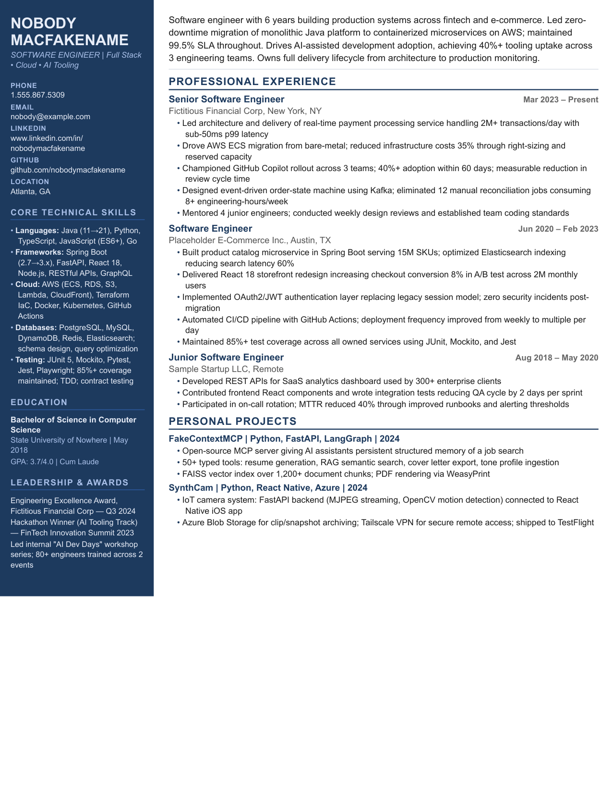 | 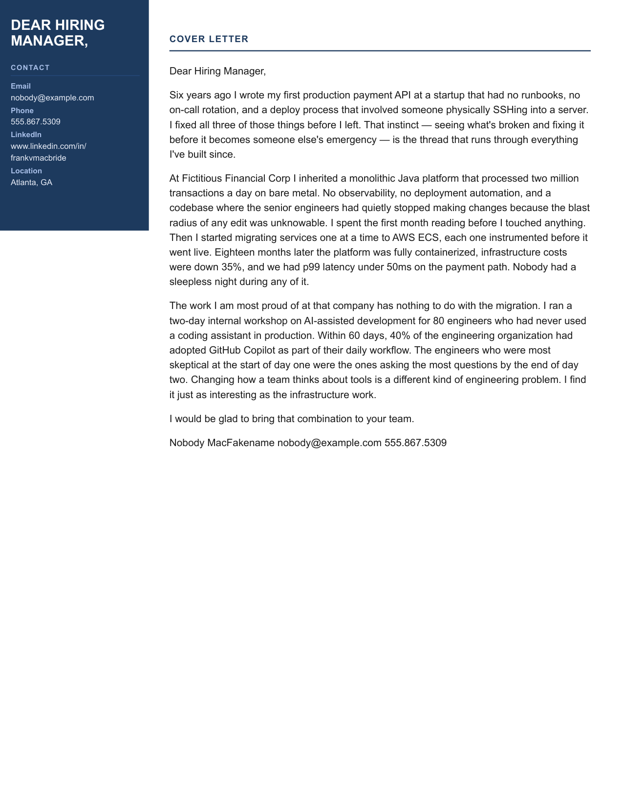 |
| Two-column: contact/skills sidebar + experience/projects main | Matching sidebar layout for the cover letter |

| Modern resume | Modern cover letter |
|---------------|---------------------|
| 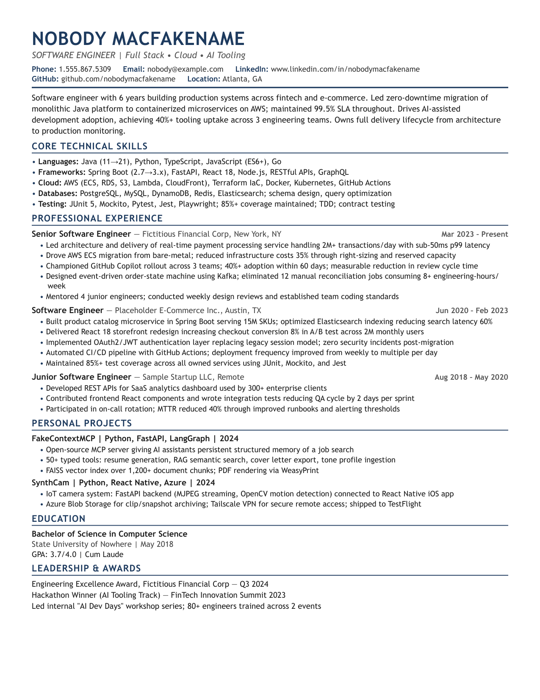 | 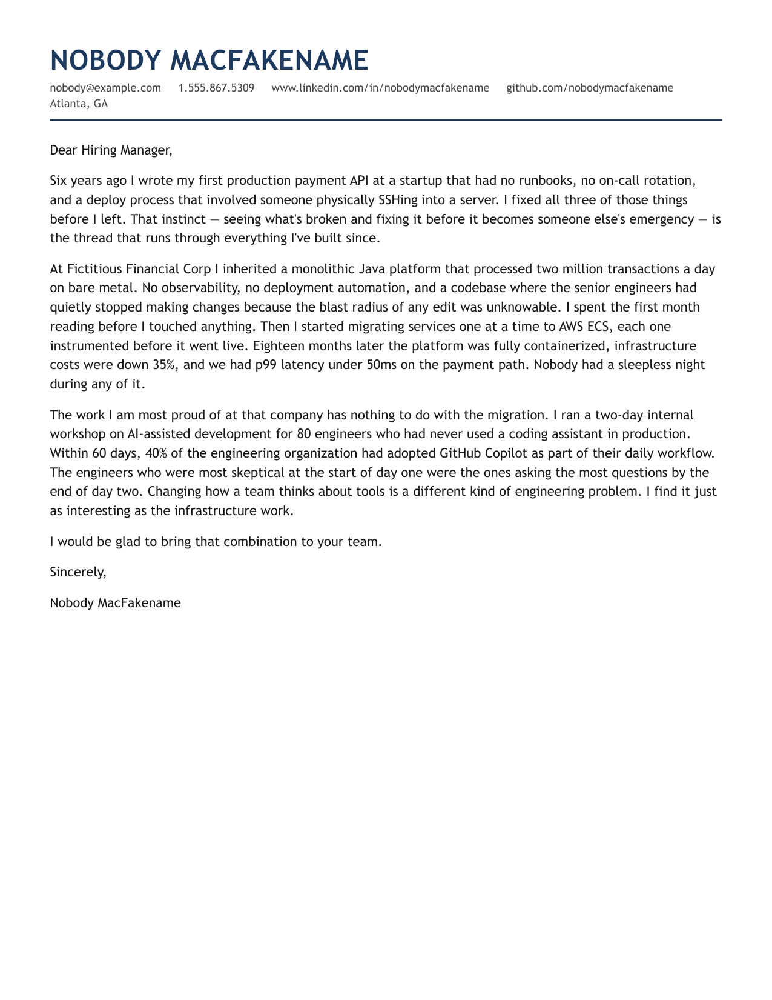 |
| Single-column, ATS-friendly, clean typography | Clean header band, flush prose paragraphs |

| Executive resume | Executive cover letter |
|------------------|------------------------|
| 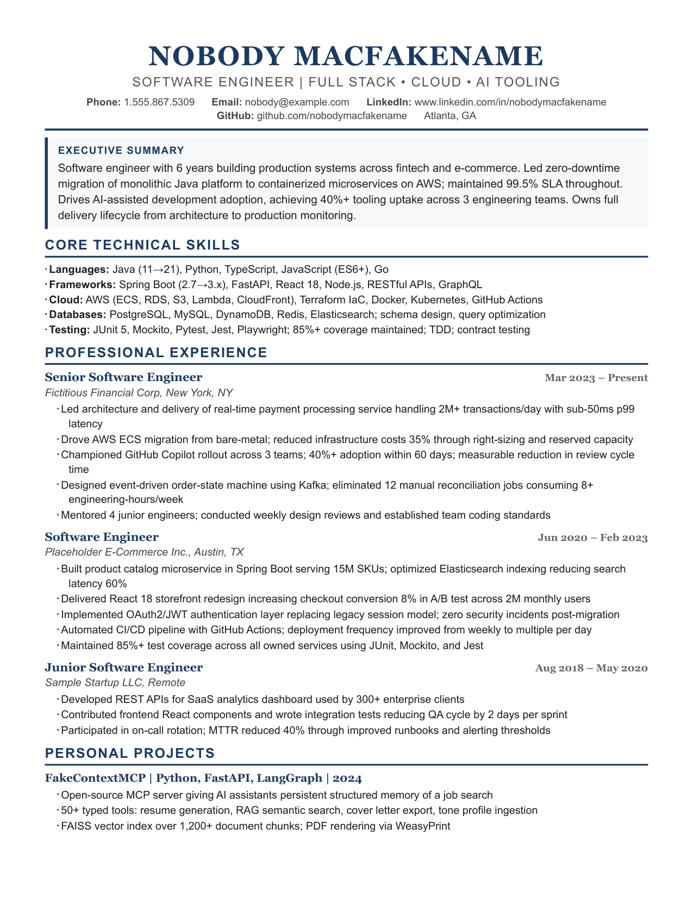 | 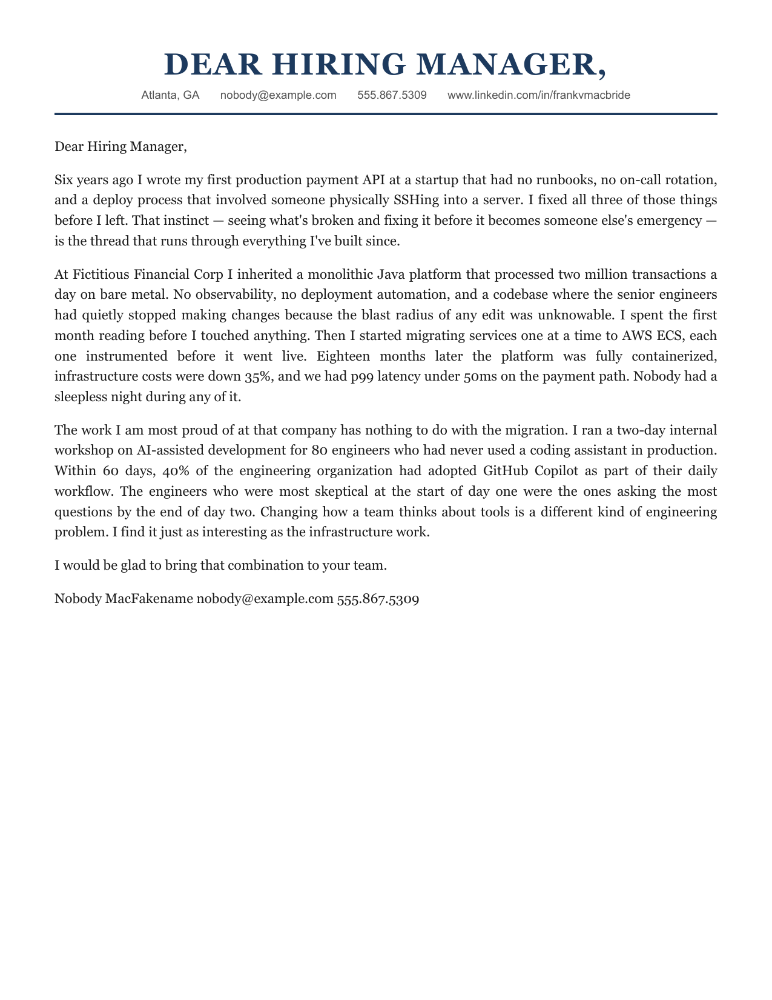 |
| Centered letterhead, serif, achievement-focused | Matching executive letterhead |

| Portfolio resume | Portfolio cover letter |
|------------------|------------------------|
| 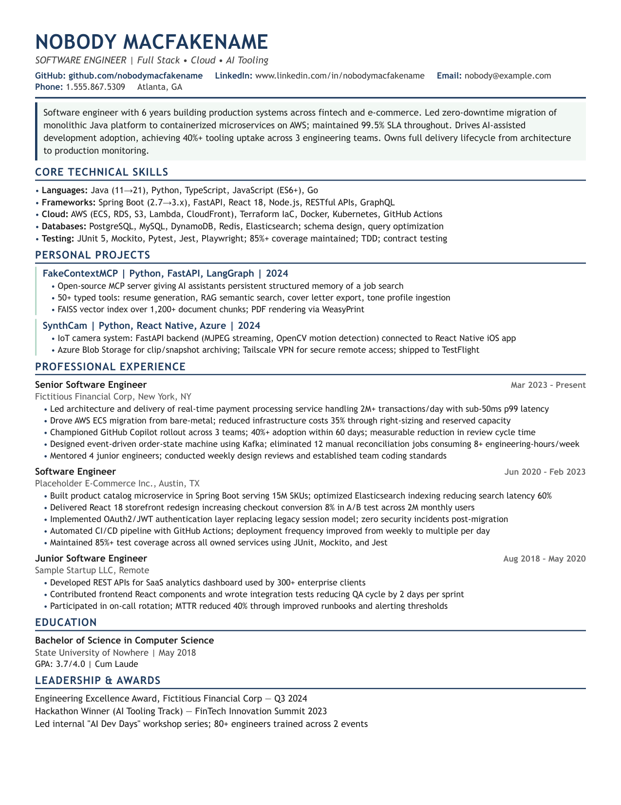 | 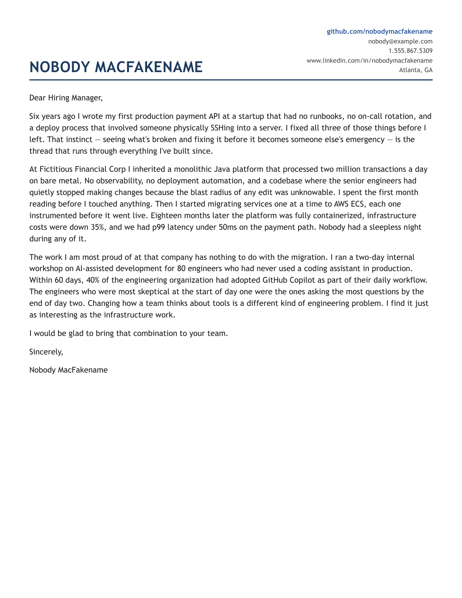 |
| Projects-first, GitHub-prominent, technical profile | Accent-strip header, project-centric intro |

Themes: **Navy** (default) · **Slate** · **Forest** · **Warm** · **Classic**

> **⚠️ No template selected?** If no template preference is saved in the pipeline, output falls back to the legacy format — Courier New, monospaced, hacker-tag header/footer. It's a genuine aesthetic choice if you want it. But if you haven't actively chosen it, your recruiter may have thoughts.
>
> | Legacy resume | Legacy cover letter |
> |---------------|---------------------|
> | 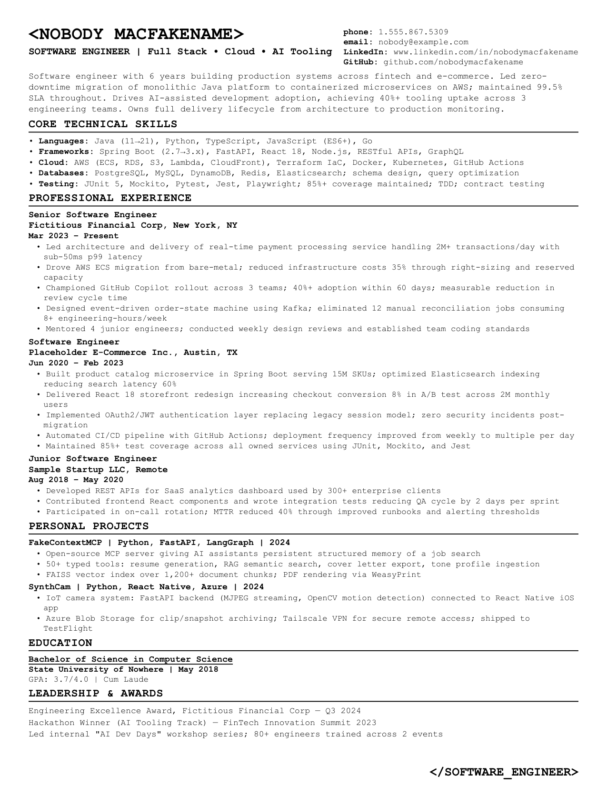 | 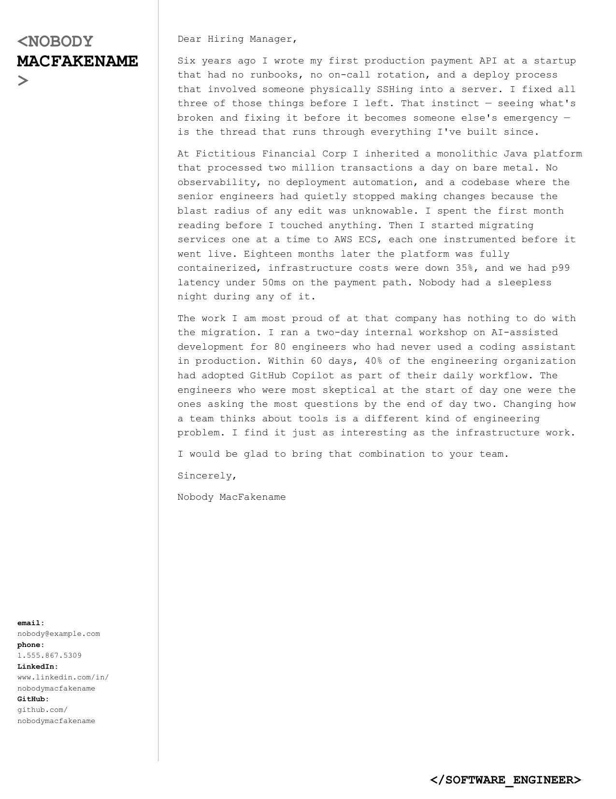 |
>
> Select a template in the pipeline and this will never happen to you.

---

## The Problem It Solves

Every new AI chat session starts with zero context. During an active job hunt you're constantly re-explaining:
- Which companies you're interviewing at and what stage you're in
- What your top resume bullets and STAR stories are
- Which problems you've practiced and which algorithm patterns you need to review
- How you're feeling today (if you track mental health alongside productivity)

This MCP server solves that by giving any AI assistant a set of tools it can call to retrieve all of that context instantly.

---

## Feature Map

JobContextMCP is now more than a stdio MCP server. The current branch combines:

| Area | Included capabilities |
|------|----------------------|
| Authentication + multi-user | Entra ID OAuth2 PKCE browser login for AKS-hosted dashboard; JWT validation (v1/v2 audience); per-user data isolation via `ContextVar` — every authenticated user (owner included) gets their own SQLite DB, workspace folder, and JSON partition under `/app/data/users/{oid}/`; auto-provisioning with placeholder resume on first login; logout button on all dashboard pages |
| Persistent context | Master resume, STAR stories, tone samples, personal stories, HBDI profile, contacts, interviews, pipeline, rejections, compensation, LinkedIn posts, mental-health logs |
| Application pipeline | Job queue, duplicate-safe intake, fitment assessment, persona lenses, add/dismiss decisions, immutable application events, compensation comparison, rejection analysis |
| Dashboard + mobile UI | Local browser dashboard, LAN/phone mode, token login, daily digest (with NEEDS DECISION queue section), pipeline triage, queue assessment, cover-letter edit dialog with draft versioning, resume/cover-letter generation, PDF export, people/outreach/wellbeing views |
| React SPA dashboard | Vite + React 18 single-page app served under `/app`, baked into the image via a multi-stage build; 10 screens (Home, Pipeline, Job Hunt kanban, Posts, Outreach, People, Materials, Interviews, Wellbeing, Settings); cookie-session auth context with protected routes; JSON feed at `/api/dashboard/home` |
| Wearables + wellbeing | Oura Ring OAuth connect flow, readiness hero on Home (gated on a real connection), per-OID token scoping, per-user OAuth tokens encrypted at rest (Fernet via `APP_ENCRYPTION_KEY`), mental-health check-ins |
| Document generation | OpenAI/Ollama-assisted resume and cover-letter generation, Copilot-assisted fallback packets, semantic story retrieval, prompt budgeting, HTML/WeasyPrint PDF export |
| Search + analytics | Local RAG index, material search, side-project skill scanning, GitHub public stats, GitHub traffic snapshots, portfolio metrics, weekly summaries |
| People + outreach | People database, single-contact lookup, referral chains, Facebook/LinkedIn cross-reference, outreach draft packets, inbound reply packets, tone review |
| Interview prep | Upcoming interviews, interview debrief logs, interview context assembly, quick-reference context, LeetCode cheatsheets, prep-document generation |
| Storage | SQLite with dual-write JSON fallback — all pipeline writes go to both; reads come from SQLite when `USE_SQLITE=1`. Migration script bootstraps from existing JSON. Sync-delete on save keeps SQLite and JSON consistent. `SQLITE_ONLY=1` skips JSON writes for mapped tables (production AKS default). |
| Deployment | AKS (Azure Kubernetes Service) — single-node cluster with workload identity, Azure Container Registry, Azure Blob Storage workspace seeding via init container (seeds all workspace dirs + DB on pod start), ConfigMap-driven config, provider-agnostic LLM (OpenAI / Azure AI Foundry keyless / Ollama). Sidecar container (`workspace-sync`) pushes PVC workspace files + DB back to Blob every 15 min so data survives pod replacement. One-shot `provision_aks.sh` idempotent provisioner. |
| Transports | MCP stdio (local/Docker), MCP Streamable HTTP (`protocolVersion: 2025-03-26`) served by FastMCP via AKS or Docker, FastAPI REST/SSE, CLI, Entra-authenticated dashboard routes, LangGraph workflow streaming |
| Provenance & trust | Deterministic truth gate on every generation path *and* the AI edit dialogs — numeric claims must trace to source material or the pipeline routes back to revision (reviewer approval alone is not enough); the verdict is surfaced in every confirmation and as a pass/fail badge in the dashboard; per-run audit records (`generation_provenance`), audited master-resume edits (`master_resume_edits`), durable gate metrics on `/metrics` for dashboards |
| Self-hosting | Disposable local k3d cluster and a documented single-node k3s deployment (proven on a Raspberry Pi 4, 4GB): arm64 image cross-builds, nightly SQLite-safe backups, Prometheus/Grafana/Loki wallboard with a rotating kiosk, and prod-metrics federation over a scoped outbound tunnel |

---

## Architecture

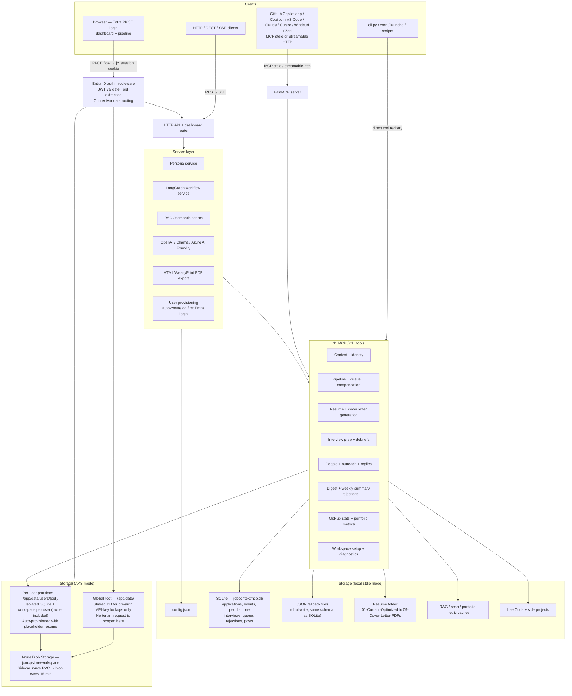
```mermaid
graph TB
  subgraph CLIENTS["Clients"]
    COPILOT["GitHub Copilot app / Copilot in VS Code / Claude / Cursor / Windsurf / Zed\nMCP stdio or Streamable HTTP"]
    CLI["cli.py / cron / launchd / scripts"]
    DASH["Browser — Entra PKCE login\ndashboard + pipeline"]
    HTTPCLIENT["HTTP / REST / SSE clients"]
  end

  COPILOT -->|"MCP stdio / streamable-http"| MCP["FastMCP server"]
  CLI -->|"direct tool registry"| TOOLS
  DASH -->|"PKCE flow → jc_session cookie"| ENTRA["Entra ID auth middleware\nJWT validate · oid extraction\nContextVar data routing"]
  HTTPCLIENT -->|"REST / SSE"| HTTP["HTTP API + dashboard router"]
  ENTRA --> HTTP

  HTTP --> SERVICES
  MCP --> TOOLS
  SERVICES --> TOOLS

  subgraph SERVICES["Service layer"]
    PERSONA["Persona service"]
    WORKFLOW["LangGraph workflow service"]
    RAG["RAG / semantic search"]
    LLM["OpenAI / Ollama / Azure AI Foundry"]
    PDF["HTML/WeasyPrint PDF export"]
    PROV["User provisioning\nauto-create on first Entra login"]
  end

  subgraph TOOLS["11 MCP / CLI tools"]
    CTX["Context + identity"]
    PIPE["Pipeline + queue + compensation"]
    DOCS["Resume + cover letter generation"]
    INTERVIEW["Interview prep + debriefs"]
    OUTREACH["People + outreach + replies"]
    ANALYTICS["Digest + weekly summary + rejections"]
    PORTFOLIO["GitHub stats + portfolio metrics"]
    SETUP["Workspace setup + diagnostics"]
  end

  subgraph FILES["Storage (local stdio mode)"]
    CONFIG["config.json"]
    SQLITE["SQLite — jobcontextmcp.db\napplications, events, people, tone\ninterviews, queue, rejections, posts"]
    DATA["JSON fallback files\n(dual-write, same schema as SQLite)"]
    MATERIALS["Resume folder\n01-Current-Optimized to 09-Cover-Letter-PDFs"]
    INDEX["RAG / scan / portfolio metric caches"]
    PROJECTS["LeetCode + side projects"]
  end

  subgraph AKS_FILES["Storage (AKS mode)"]
    AKS_GLOBAL["Global root — /app/data/\nShared DB for pre-auth API-key lookups only\nNo tenant request is scoped here"]
    AKS_USERS["Per-user partitions — /app/data/users/{oid}/\nIsolated SQLite + workspace per user (owner included)\nAuto-provisioned with placeholder resume"]
    BLOB["Azure Blob Storage — jcmcpstore/workspace\nSidecar syncs PVC → blob every 15 min"]
  end

  SERVICES --> CONFIG
  TOOLS --> SQLITE
  TOOLS --> DATA
  TOOLS --> MATERIALS
  TOOLS --> INDEX
  TOOLS --> PROJECTS
  TOOLS --> AKS_USERS
  ENTRA --> AKS_USERS
  ENTRA --> AKS_GLOBAL
  AKS_GLOBAL --> BLOB
  AKS_USERS --> BLOB
```

### Module structure

| Module | Contents |
|--------|----------|
| `server.py` | FastMCP server — tool registration, startup, config sync |
| `tools/generate.py` | Resume + cover letter generation logic |
| `tools/generate_prompts.py` | Format-spec and system-prompt string constants |
| `tools/export.py` | PDF rendering + MCP tool wrappers |
| `lib/resume_parser.py` | `.txt` → structured-dict parsers (resume + cover letter) |
| `transport/http/routes/dashboard/pipeline.py` | Pipeline route handlers |
| `transport/http/routes/dashboard/pipeline_helpers.py` | Request models, data-access, scoring helpers |
| `lib/auth.py` | Entra ID JWT validation + `EntraAuthMiddleware` |
| `lib/user_context.py` | Per-request `ContextVar` data routing |
| `lib/db.py` | SQLite connection helper |

### Entra ID Login Flow (AKS dashboard)

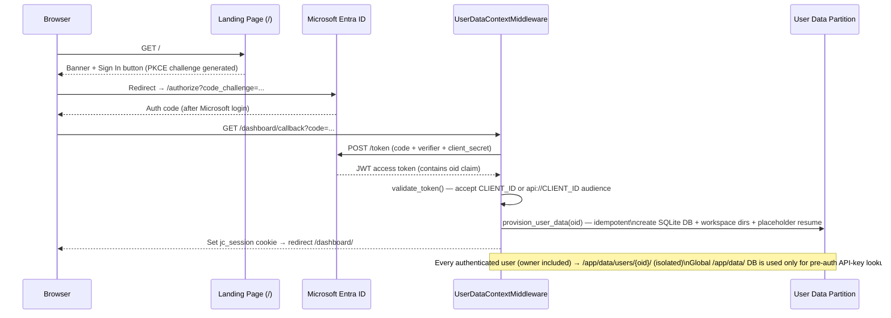
```mermaid
sequenceDiagram
    participant Browser
    participant Landing as Landing Page (/)
    participant Entra as Microsoft Entra ID
    participant MW as UserDataContextMiddleware
    participant Store as User Data Partition

    Browser->>Landing: GET /
    Landing-->>Browser: Banner + Sign In button (PKCE challenge generated)
    Browser->>Entra: Redirect → /authorize?code_challenge=...
    Entra-->>Browser: Auth code (after Microsoft login)
    Browser->>MW: GET /dashboard/callback?code=...
    MW->>Entra: POST /token (code + verifier + client_secret)
    Entra-->>MW: JWT access token (contains oid claim)
    MW->>MW: validate_token() — accept CLIENT_ID or api://CLIENT_ID audience
    MW->>Store: provision_user_data(oid) — idempotent\ncreate SQLite DB + workspace dirs + placeholder resume
    MW-->>Browser: Set jc_session cookie → redirect /dashboard/

    note over MW,Store: Every authenticated user (owner included) → /app/data/users/{oid}/ (isolated)\nGlobal /app/data/ DB is used only for pre-auth API-key lookups
```

### End-to-End: Mobile/Dashboard Pipeline Flow

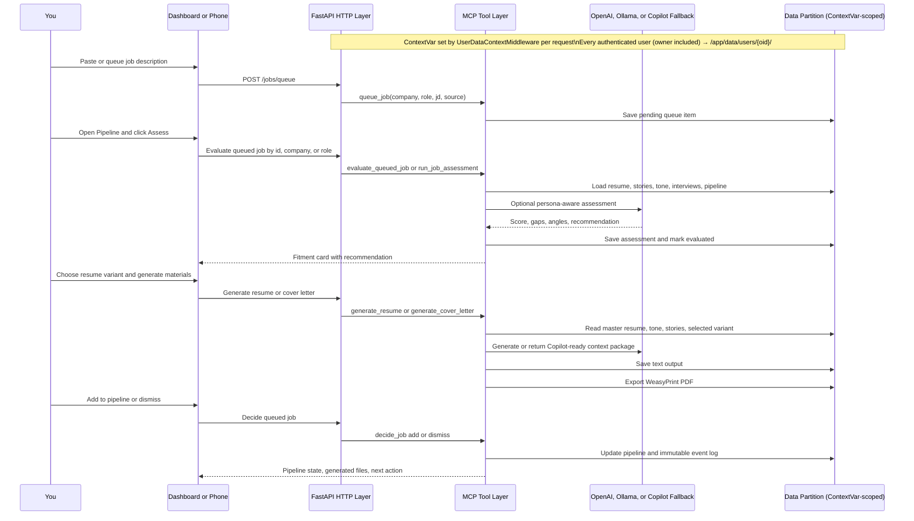
```mermaid
sequenceDiagram
    participant You
    participant UI as Dashboard or Phone
    participant API as FastAPI HTTP Layer
    participant Tools as MCP Tool Layer
    participant LLM as OpenAI, Ollama, or Copilot Fallback
    participant Store as Data Partition (ContextVar-scoped)

    note over API,Store: ContextVar set by UserDataContextMiddleware per request\nEvery authenticated user (owner included) → /app/data/users/{oid}/

    You->>UI: Paste or queue job description
    UI->>API: POST /jobs/queue
    API->>Tools: queue_job(company, role, jd, source)
    Tools->>Store: Save pending queue item

    You->>UI: Open Pipeline and click Assess
    UI->>API: Evaluate queued job by id, company, or role
    API->>Tools: evaluate_queued_job or run_job_assessment
    Tools->>Store: Load resume, stories, tone, interviews, pipeline
    Tools->>LLM: Optional persona-aware assessment
    LLM-->>Tools: Score, gaps, angles, recommendation
    Tools->>Store: Save assessment and mark evaluated
    Tools-->>UI: Fitment card with recommendation

    You->>UI: Choose resume variant and generate materials
    UI->>API: Generate resume or cover letter
    API->>Tools: generate_resume or generate_cover_letter
    Tools->>Store: Read master resume, tone, stories, selected variant
    Tools->>LLM: Generate or return Copilot-ready context package
    Tools->>Store: Save text output
    Tools->>Store: Export WeasyPrint PDF

    You->>UI: Add to pipeline or dismiss
    UI->>API: Decide queued job
    API->>Tools: decide_job add or dismiss
    Tools->>Store: Update pipeline and immutable event log
    Tools-->>UI: Pipeline state, generated files, next action
```

---

## Tools

| Tool | Purpose |
|------|---------|
| `get_job_hunt_status()` | Full pipeline — all active applications, contacts, next steps |
| `update_application(company, role, status, ...)` | Add or update an application |
| `queue_job(company, role, jd, source?)` | **v0.6.5** — drop a JD into the evaluation inbox (`pending`); duplicate submissions return a message rather than overwriting |
| `get_job_queue(status?)` | **v0.6.5** — list queued jobs, optionally filtered by `pending` / `evaluated` / `added` / `dismissed` |
| `evaluate_queued_job(company, role, persona?)` | **v0.6.5** — load stored JD and assemble fitment context for review; advances status to `evaluated` (required before deciding). **v0.7.1** — optional `persona` prepends a persona lens to the context pack |
| `decide_job(company, role, decision, notes?, fitment_score?)` | **v0.6.5** — `add` creates pipeline entry at status `interested`; `dismiss` soft-deletes; gate enforced on evaluation |
| `read_master_resume()` | Your master resume (source of truth for all customizations) |
| `list_existing_materials(company?)` | List generated resumes + cover letters |
| `read_existing_resume(filename)` | Read a specific resume file |
| `read_reference_file(filename)` | Read from a reference materials folder |
| `assess_job_fitment(company, role, jd, persona?)` | Packages your resume + JD for AI fitment analysis. **v0.7.1** — optional `persona` prepends a persona lens (e.g. `faang_technical`, `executive_polish`) so the consuming agent applies role-specific weighting |
| `run_job_assessment(company, role, jd, persona?, auto_save?)` | **v0.7.1** — LLM-powered fitment scoring (OpenAI). Returns score, strong matches, gaps, key angles, comp assessment, recommendation. Optional `persona` prepended to the system prompt. Auto-saves to `07-Job-Assessments` unless `auto_save=False`. Falls back to context-pack mode when no OpenAI key is configured |
| `get_customization_strategy(role_type)` | Resume emphasis guide by role type |
| `get_interview_quick_reference()` | STAR stories + system design framework on demand |
| `get_leetcode_cheatsheet(section?)` | Algorithm patterns — full cheatsheet or by topic |
| `generate_interview_prep_context(company, role, stage)` | Structured context for AI-generated prep docs |
| `get_existing_prep_file(company)` | Read any existing prep file for a company |
| `scan_project_for_skills()` | Scan a side-project repo for resume-worthy skills |
| `log_mental_health_checkin(mood, energy, ...)` | Log a mood/energy entry |
| `get_mental_health_log(days?)` | Recent check-in history with trend summary |
| `search_materials(query, category?)` | **RAG** — semantic search across all indexed materials |
| `reindex_materials()` | **RAG** — (re)build the semantic search index for all materials AND the personal story library |
| `reindex_stories()` | **RAG** — (re)build only the story semantic embedding index; run after adding stories via `log_personal_story()` or `ingest_anecdote()` to enable semantic cover letter retrieval |
| `log_personal_story(story, tags, people?, title?)` | **v3** — log a personal story or memory for context-rich writing |
| `get_personal_context(tag?, person?)` | **v3** — retrieve stories filtered by tag or person |
| `ingest_anecdote(story, tags, title?, people?, tone_sample?)` | **v5.2** — single-call bundler: logs to personal context, optionally ingests as tone sample (≥40 words), and reports STAR tag matches |
| `log_tone_sample(text, source, context?)` | **v3** — ingest a writing sample to teach the AI your voice |
| `get_tone_profile()` | **v3** — retrieve all tone samples before drafting communications |
| `scan_materials_for_tone(category?)` | **v3** — auto-scan resumes/cover letters/prep files and index new tone samples |
| `get_star_story_context(tag, company?, role_type?)` | **v3** — retrieve STAR stories, metric bullets, and company-specific framing hints |
| `draft_outreach_message(contact, company, context, message_type?)` | **v4** — package tone profile, personal context, and writing instructions for AI-drafted outreach |
| `export_resume_pdf(filename, footer_tag?, output_filename?)` | **v4** — parse a .txt resume and render it to PDF |
| `export_cover_letter_pdf(filename, output_filename?, footer_tag?)` | **v4** — parse a .txt cover letter and render it to PDF with two-column sidebar and configurable footer/title tag |
| `generate_resume(company, role, job_description, output_filename?)` | **v4.1** — generate tailored resume via OpenAI API (or context package for Copilot), auto-save + export PDF |
| `generate_cover_letter(company, role, job_description, output_filename?)` | **v4.1** — generate tailored cover letter, auto-save + export PDF; now cleans scraped JD noise and uses semantic story retrieval for mission/brand hooks |
| `log_linkedin_post(text, source, context?, posted_date?, url?, hashtags?, links?, title?)` | **v4.8** — store a LinkedIn post with metadata; auto-ingests as tone sample by default |
| `update_post_metrics(post_id?, source?, impressions?, reactions?, ...)` | **v4.8** — update engagement metrics and audience demographics on a stored post |
| `get_linkedin_posts(source?, hashtag?, min_reactions?, include_text?)` | **v4.8** — retrieve posts with filterable aggregate metrics summary |
| `log_rejection(company, role, stage, reason?, notes?, date?)` | **v5** — log a rejection; stored in `data/rejections.json` for pattern analysis |
| `get_rejections(company?, stage?, since?, include_pattern_analysis?)` | **v5** — retrieve rejections with optional filters and stage/reason pattern breakdown |
| `log_application_event(company, role, event_type, notes?)` | **v5** — append an event to an application's immutable event log (phone screen, offer, note, etc.) |
| `get_daily_digest()` | **v5** — morning briefing: overdue follow-ups, stale apps, recent rejections, drafted-not-sent messages, 3 focus priorities |
| `weekly_summary()` | **v5** — 7-day aggregate: new apps, rejections by stage, contacts added, mental health trend |
| `update_compensation(company, role, base?, equity_total?, bonus_target_pct?, level?, ...)` | **v5** — attach comp data (base/equity/bonus) to a tracked application; computes total comp estimate |
| `get_compensation_comparison()` | **v5** — side-by-side comp table for all applications with comp data, sorted by total comp |
| `resume_diff(file_a, file_b)` | **v5** — unified diff between two resume `.txt` files with added/removed line summary |
| `review_message(text)` | **v5** — tone review for outreach drafts: flags corporate phrases, desperation signals, hedging, weak openers, missing CTAs |
| `check_workspace()` | **v0.6** — diagnostic scan: reports present/missing `config.json`, data files, workspace directories, master resume word count, and OpenAI key status |
| `setup_workspace(name, email, phone, linkedin, city_state, master_resume_content, ...)` | **v0.6** — conversational bootstrapper: creates `config.json`, core runtime data files, and resume directories `01–08` from a single chat; idempotent — safe to re-run |
| `run_hbdi_assessment(q1_no_spec_project, q2_critical_feedback, q3_tedious_finish, q4_senior_disagreement, score_a, score_b, score_c, score_d)` | **v0.6** — HBDI cognitive style profiler: scores A/B/C/D quadrants, generates interview framing advice calibrated to your primary style, saves profile to personal context |
| `get_hbdi_profile()` | **v0.6** — retrieve stored HBDI profile with quadrant synthesis and interview framing advice |
| `log_interview(company, role, interview_date, interview_type, interviewer?, what_landed?, what_didnt?, verbatim_quotes?, surfaced_priorities?, comp_signals?, follow_up_commitments?, ...)` | **v0.6.2** — structured debrief logger for recruiter screens, hiring manager calls, panels, and onsite loops; captures verbatim quotes, HM priorities absent from the JD, process details, and follow-ups |
| `get_interviews(company?, role?, interview_type?, since?, limit?)` | **v0.6.2** — retrieve stored interviews with filters; most-recent-first |
| `get_interview_context(company, role?)` | **v0.6.2** — assemble all interviews for a company/role into one context block; auto-pulled by `assess_job_fitment()`, `generate_resume()`, and `generate_cover_letter()` when a match exists |
| `get_person(name)` | **v0.6.4** — single-record lookup by partial name (case-insensitive); returns full record or disambiguation list; token-efficient alternative to `get_people()` for individual lookups |
| `get_people(name?, company?, tag?, outreach_status?, slim?)` | retrieve/search the people database; `slim=True` returns name/company/relationship/status/tags only — no notes or context — for low-cost list scans |
| `run_contact_crossref(fb_folder?)` | **v0.6.3** — ingest a Facebook export folder and cross-reference confirmed friends, pending requests, and removed connections against LinkedIn connections and your internal people tracker; writes `contact_crossref.json` and updates per-connection `facebook_match` metadata in `linkedin_connections.json`; re-runnable on any fresh export |
| `get_contact_crossref(insight?, name?)` | **v0.6.3** — query the cross-platform registry by insight bucket (`all_three_platforms`, `fb_friend_and_linkedin`, `fb_removed_still_on_linkedin`, etc.) or look up any contact by name; returns platform presence, relationship type, and action hints |
| `get_github_stats(username)` | **v0.7** — public GitHub profile + top non-fork repos via REST (stars, forks, language, last-pushed); uses `GITHUB_TOKEN` env if set; offline stub via `JOBCONTEXTMCP_OFFLINE=1` |
| `refresh_portfolio_metrics()` | **v0.9** — snapshots GitHub clone/view traffic for configured repositories into durable local history so GitHub's rolling 14-day traffic window is not lost |
| `get_portfolio_metrics()` | **v0.9** — returns resume/STAR-ready GitHub portfolio metrics with trailing-14-day momentum and cumulative observed clones from local history |
| `get_upcoming_interviews(days_ahead?)` | **v0.7** — filters logged interviews to a forward window (default 14 days); sorted soonest-first with "today" / "in Nd" labels |
| `get_referral_chains(target_company)` | **v0.7** — groups contacts into `direct` (company match) and `adjacent` (company mentioned in tags/context/notes) for referral planning |
| `draft_reply(incoming_message, contact?, company?, intent?)` | **v0.7** — package tone profile, personal context, contact context, and intent-specific posture (`accept` / `decline_polite` / `decline_compensation` / `request_info` / `delay` / `enthusiastic_yes`) for AI-drafted replies to inbound messages |
| `scrape_job_url(url, auto_queue?)` | **v0.8** — fetch any job posting URL via Jina Reader, extract company/role/JD, and optionally queue it; works with Greenhouse, Lever, Ashby, Workday, and most company career pages |
| `search_jobs(query, location?, num_results?, auto_queue?)` | **v0.8** — search Google Jobs via SerpAPI; requires `serpapi_key` in config; `auto_queue=True` pipelines all results directly |
| `search_greenhouse_jobs(company_slug, query?, num_results?, auto_queue?)` | **v0.8** — browse all open roles on any Greenhouse job board; free, no API key required |
| `search_lever_jobs(company_slug, query?, num_results?, auto_queue?)` | **v0.8** — browse all open roles on any Lever job board; free, no API key required |
| `generate_resume_agent(company, role, job_description)` | **v0.9** — LangGraph multi-stage resume pipeline: `assess → draft → review → [revise →] finalize`; higher-quality output than a single LLM call; falls back to `generate_resume()` context-packing when no LLM is configured |
| `get_all_star_context()` | **v0.9** — dump the complete STAR library in one call: all personal stories, all metric bullets by category, all company framing hints; used at session boot for full interview prep picture |
| `get_fb_outreach_queue(limit?, offset?, sort_by?, include_pending?)` | **v0.9** — prioritized queue of Facebook friends not yet connected on LinkedIn; sorted by recency (freshest relationships first); active job target companies included so the AI can flag anyone who works there |
| `save_interview_prep(company, content, filename?)` | Save a generated interview prep document to `08-Interview-Prep-Docs/` as a `.md` file; filename defaults to `{COMPANY}_INTERVIEW_PREP.md`; overwrites for iterative improvement |
| `save_job_assessment(company, content, filename?, source?)` | Save a generated fitment assessment to `07-Job-Assessments/` (or `07-Job-Assessments/<source>/` subfolder); filename defaults to `{Company} - Fitment Assessment.md` |

---

## v1.4 — Visible provenance: the verdict reaches the user, and edits face the gate

v1.3 built the truth gate; v1.4 makes it visible and closes its last gap. Every generation confirmation now ends with a one-line verdict from a single shared formatter (`Provenance: ✓ PASS — 6 claims traced to source, 0 unsourced` / `Provenance: ⚠ 2 unsourced — "47%", "$9M"`), and the dashboard renders it as a green/amber badge — after generating from the pipeline, and inside the AI edit dialogs right where you decide to accept or discard a draft. Those edit dialogs had been calling the LLM without the gate at all; they now run the same observe-and-report check with their own audit kinds (`resume_edit`, `cover_letter_edit`), so an inline edit can no longer smuggle in a fabricated metric silently. The mobile app gains over-the-air JS updates and real navigation (detail pages, global search, timeline), and the Home dashboard's cards all lead somewhere. Full details in the CHANGELOG.

---

## v1.3 — The provenance release: truth-checked generation, audited edits, self-hosted Kubernetes

v1.3 answers a question every LLM-generated document should face: *can each claim be traced to a source?* A deterministic provenance gate now sits in every generation path — numeric claims (percentages, dollar amounts, magnitudes, years) must exist in the run's source material or the pipeline routes back for revision, with the LLM reviewer's approval explicitly insufficient on its own. Every run writes an audit record; edits to the master resume itself (the gate's ground truth) are audited too, closing the loop where an agent could otherwise legalize a fabricated claim by first writing it into the source. Gate verdicts and pass rates are exported as restart-durable metrics for dashboards.

The release also makes the product genuinely self-hostable: the Docker image now cross-builds for arm64 (a hardcoded x86_64 LaTeX binary had silently blocked Apple Silicon and Raspberry Pi), and the repo ships two new deployment targets — a disposable local k3d cluster for pre-deploy testing, and a documented single-node k3s deployment proven on a Raspberry Pi 4 with nightly backups, a Prometheus/Grafana/Loki wallboard, and production-metrics federation over a scoped outbound tunnel. Full details in the CHANGELOG.

---

## v1.0–v1.2 — React SPA dashboard, Oura Ring, encrypted tokens, and multi-tenant hardening

The v1.x line moves the hosted product onto a dedicated React single-page app, adds wearable-driven wellbeing signals, encrypts per-user secrets at rest, and closes a multi-tenant data-isolation bug.

### React SPA dashboard

A new Vite + React 18 dashboard is served under `/app` and baked into the container via a multi-stage Docker build (Node builder → Python runtime). It becomes the primary UI for authenticated users while the legacy server-rendered routes remain for local use.

- **10 screens** — Home, Pipeline, Job Hunt (kanban), Posts, Outreach, People, Materials, Interviews, Wellbeing, Settings.
- **Cookie-session auth context** with protected client routes; unauthenticated users are bounced to login, and post-login now lands on `/app` instead of the legacy dashboard.
- **JSON feed** — `GET /api/dashboard/home` backs the Home screen (Oura readiness + pipeline hero) without server-side templating.
- History-mode routing: the SPA shell + hashed assets are public; every data API stays behind auth.

### Oura Ring integration

- Real Oura OAuth connect flow wired into the SPA Settings screen (callback `/dashboard/oura/callback`).
- **Readiness hero** on Home; the panel only renders when a ring is actually connected, otherwise the digest shows.
- Owner-gated enablement: when `OURA_CLIENT_ID` / `OURA_CLIENT_SECRET` are absent the connect control shows "not enabled" rather than erroring.
- All Oura reads are scoped to the current user OID; the migration retrofit backfills historical rows safely.

### Security — encrypted tokens at rest

Per-user OAuth tokens (Oura, and future providers) are encrypted with a Fernet key from `APP_ENCRYPTION_KEY`. When the key is absent, tokens fall back to cleartext (prior behavior), so local dev is unaffected; production and QA set the key via the app-secrets K8s secret.

### Multi-tenant data-isolation fix

- Fixed per-user data-partition **path doubling** (`data/users/<oid>/users/<oid>/…`) caused by the tenant-aware I/O resolver re-applying an already-resolved override in `lib/io.py`.
- `check_workspace()` now reads the per-user config under an active tenant override instead of the repo-root base config.
- `setup_workspace()` persists per-user resolution keys (master resume path, cheatsheet, quick-reference, LeetCode language) so a tenant's files resolve to their own partition instead of inheriting owner defaults.

### Hosted QA environment

A parallel `qa.jobcontext.ai` environment runs on the existing AKS cluster (namespace `jcmcp-qa`, its own storage account + PVC, shared workload identity via a QA federated credential). Pushes to the `qa` branch build a `qa-<sha>` image and roll it out independently of production.

### Rebrand

Unified framed-badge brand identity across all public and app surfaces (favicon, apple-touch-icon, LinkedIn banner, og-image, and the landing/login/architecture/setup and sub-landing pages).

---

## v0.7–v0.9 — HTTP transport, mobile dashboard, personas, LangGraph workflows, and portfolio metrics

The v0.7–v0.9 line turns the project from a stdio-only MCP server into a local job-search operating layer. MCP tools, REST/SSE APIs, dashboard routes, mobile/LAN access, persona-aware generation, workflow streaming, and portfolio analytics all share the same local data files.

### HTTP + SSE transport (FastAPI)

A new `transport/http/` package exposes core capabilities over REST + Server-Sent Events for clients that don't speak MCP (mobile, browser, scripts, Open WebUI):

```bash
# From the project root (reads HOST / PORT / ENABLE_REMOTE / API_KEY from environment)
PORT=8000 .venv/bin/python -m transport.http.main

# LAN / Tailscale access
ENABLE_REMOTE=true PORT=8000 .venv/bin/python -m transport.http.main
```

Endpoints:

- `GET /health`
- `GET /context/session` — same payload as the MCP `get_session_context()` tool
- `POST /resumes/generate` — sync resume generation; body `{ "company", "role", "job_description", "persona?" }`
- `POST /resumes/generate/stream` — same call, SSE stream of progress events
- `POST /jobs/evaluate` — queue + assess a pasted job description
- `POST /jobs/ingest-url` — fetch a job URL, queue it, and run fitment evaluation; used by the iOS Share Sheet shortcut. Works best with canonical ATS pages (Greenhouse, Lever, Ashby, Workday, company career sites). For LinkedIn postings, use LinkedIn as the discovery layer — tap **Apply** to reach the employer's ATS page, then share that URL instead.
- `POST /jobs/decide` — add or dismiss an evaluated job
- `GET /personas` / `GET /personas/{name}` — list/inspect persona configs
- `GET /workflows` / `POST /workflows/{name}` / `POST /workflows/{name}/stream` — invoke LangGraph workflows
- `GET /dashboard/` and focused `/dashboard/*` routes — browser/mobile UI over the same services
- All write endpoints require `Authorization: Bearer <token>` when `API_KEY` is set in the environment; bind to `127.0.0.1` for LAN-only use or expose over Tailscale.

### Web dashboard quick start (local + phone)

The dashboard at `/dashboard/` is the visual layer over the same local data and services exposed through MCP/HTTP. Current views include:

- **Home / Daily Digest** — follow-ups, stale applications, upcoming interviews, recent rejections, post metrics, wellbeing nudges, and priority focus areas. The digest page is available at `GET /dashboard/digest`; `POST /dashboard/digest/generate` regenerates the parsed briefing with a spinner, timestamp, and collapsible sections.
- **Pipeline** — queue jobs, evaluate fitment, inspect assessment details, select resume variants, generate tailored resumes and cover letters, export PDFs, add/dismiss jobs, and remove queued items from one job-id-driven flow.
- **Job Hunt** — application status, immutable event history, next steps, compensation data, and stale-item cleanup.
- **Materials** — generated resumes, cover letters, PDFs, reference files, diffs, and exports.
- **Rejections** — rejection logging, filtering, stage/reason pattern analysis, and digest integration.
- **Posts** — LinkedIn post logging, metrics updates, source/hashtag filters, and tone-sample reuse.
- **Outreach / People** — people lookup, slim scans, contact detail views, referral planning, message review, and reply-drafting context.
- **Wellbeing** — mood/energy logs, trend summaries, and job-search sustainability check-ins.
- **Portfolio** — GitHub public repo stats and durable traffic snapshots for resume/STAR-ready project metrics.

When `API_KEY` is configured, browser login uses the same token model as the HTTP API. `/dashboard/login` sets an HTTP-only `jc_session` cookie for the local dashboard, `/dashboard/logout` clears it, and API-style calls can still use `Authorization: Bearer <token>`. The auth provider reads settings fresh at request time so changing the token does not require stale in-memory state cleanup.

Use the helper script so you don't have to remember startup flags each time:

```bash
# LAN / Tailscale access (prints your IPs on startup)
bash scripts/start_server.sh

# Local machine only
PORT=8000 .venv/bin/python -m transport.http.main

# Check what's running on port 8000
lsof -i tcp:8000

# Stop it
lsof -ti tcp:8000 | xargs kill
```

When running in LAN mode, open:

```text
http://<YOUR_MAC_LAN_IP>:8000/dashboard/
```

Notes:
- Mac and phone must be on the same Wi-Fi.
- If browser can't connect, allow incoming connections for Terminal/Python in macOS Firewall.
- If you expose LAN access, set `API_KEY` in your environment before running.
- For AI/LLM/RAG roles, the pipeline can recommend the Modern/AI resume variant and pass that selection through to cover-letter title/export settings.

### iOS Share Sheet shortcut setup

The mobile pipeline starts from any app that exposes a job URL to the iOS Share Sheet. The shortcut posts the shared URL to `POST /jobs/ingest-url`; the server fetches the posting, parses company/role/JD text, queues it, runs fitment evaluation, and makes the result visible in `/dashboard/pipeline`.

**Recommended source URLs:** Greenhouse, Lever, Ashby, Workday, and direct company career pages. These sites serve the canonical job description to any HTTP client and are consistently parseable.

**LinkedIn note:** LinkedIn restricts automated access to its job pages, so sharing a `linkedin.com/jobs/view/` URL won't extract the posting. Use LinkedIn as the discovery layer instead:

```
Find on LinkedIn → tap Apply → ATS page opens → Share ATS URL → shortcut queues it
```

This is actually a better data source. ATS pages typically have more complete job descriptions, accurate location requirements, salary data when posted, and fewer formatting artifacts than LinkedIn's copy. "Ingested directly from the employer's ATS" is also a cleaner story than scraping LinkedIn.

For jobs without an Apply button or with a broken ATS link, the Pipeline page has a **＋ Add Job** button — paste the company, role, and JD text directly.

Prerequisites:

1. Start the dashboard in LAN / Tailscale mode on your Mac:

  ```bash
  bash scripts/start_server.sh
  ```

2. Confirm your phone can open the dashboard URL printed by the script, for example:

  ```text
  http://192.168.68.66:8000/dashboard/
  ```

3. If `API_KEY` is set, keep that token handy. The shortcut must send the same bearer token as the dashboard/API.

Create the Shortcut:

1. Open **Shortcuts** on iPhone or iPad.
2. Tap **+** and name it `Queue Job in JobContextMCP`.
3. Tap the shortcut info button and enable **Show in Share Sheet**.
4. Under **Share Sheet Types**, allow **URLs** and **Safari Web Pages**. Optional: also allow **Text** if you sometimes share copied URLs as text.
5. Add action: **Receive URLs from Share Sheet**.
6. Add action: **Get URLs from Input**. This normalizes Safari pages into a plain URL.
7. Add action: **Get Contents of URL**.
  - URL: `http://<YOUR_MAC_LAN_IP>:8000/jobs/ingest-url`
  - Method: `POST`
  - Headers:
    - `Content-Type`: `application/json`
    - `Authorization`: `Bearer <API_KEY>` *(only if auth is enabled)*
  - Request Body: `JSON`
  - JSON fields:
    - `url`: the output of **Get URLs from Input**
    - `source`: `ios_share_sheet`
    - `persona`: optional, for example `faang_technical` or `executive_polish`
8. Add action: **Show Result** using the response from **Get Contents of URL**.
9. Optional final action: **Open URLs** with `http://<YOUR_MAC_LAN_IP>:8000/dashboard/pipeline` so the shortcut drops you into the queued job list.

Usage:

1. Find a job on LinkedIn (or anywhere else).
2. Tap **Apply** — this opens the employer's ATS page in Safari.
3. Tap **Share** from Safari.
4. Choose **Queue Job in JobContextMCP**.
5. Wait for the response, then open the dashboard Pipeline page to review the assessment, choose a resume variant, generate materials, and queue/apply.

Troubleshooting:

- If the shortcut returns `401`, the `Authorization` header is missing or the token does not match `API_KEY`.
- If it cannot connect, confirm the Mac and phone are on the same Wi-Fi, the dashboard is running (`bash scripts/start_server.sh`), and macOS Firewall allows Python/Terminal incoming connections.
- If `/jobs/ingest-url` returns a LinkedIn-blocked message, you shared the LinkedIn URL instead of the ATS URL. Tap Apply on the LinkedIn page first to get to the employer's site, then share.
- If the Mac changes networks, the LAN IP can change. Run `lsof -i tcp:8000` to confirm the server is up and re-check the IP printed at startup.

### Per-user API keys

Each authenticated user can generate personal programmatic access tokens from the dashboard at `/dashboard/api-keys`. Unlike the global `API_KEY` environment variable (which is admin-level), per-user keys are scoped to your own data partition and are the recommended credential for iOS Shortcuts, CLI scripts, and any automation tool that needs to call HTTP endpoints without a browser session.

Keys start with `jcmcp_` and are shown once at generation time. Multiple keys can be active simultaneously — one per device or script — and each can be revoked individually without affecting other keys or your browser session.

**Generate a key:**

1. Open the dashboard and click **API Keys** in the top nav.
2. Enter a label (e.g. `iPhone Shortcut` or `Home Mac CLI`).
3. Click **Generate key**.
4. Copy the full `jcmcp_...` token immediately. It is shown once; if you lose it, revoke and regenerate.

**Use with iOS Shortcuts:**

In the **Get Contents of URL** action of your shortcut, expand **Headers** and add:

| Header name | Value |
|-------------|-------|
| `Authorization` | `Bearer jcmcp_<paste-token-here>` |

The per-user key is scoped to your own workspace — it cannot read or write another user's data even if the server URL is shared. If you previously used the global `API_KEY` in your shortcut, replace it with your per-user token here.

**Use from scripts or the CLI:**

```bash
# Single request
curl -H "Authorization: Bearer jcmcp_<your-token>" \
  https://your-server/context/session

# Set for the session
export JCMCP_TOKEN="jcmcp_<your-token>"
curl -H "Authorization: Bearer $JCMCP_TOKEN" \
  https://your-server/jobs/evaluate
```

**Revocation:** Dashboard → **API Keys** → **Revoke** next to the key. Takes effect immediately on all clients using that token.

### Persona configs

`services/persona_service.py` loads JSON persona presets from `data/personas/` (bundled defaults: `default`, `executive_polish`, `faang_technical`, `startup_founder`). Drop your own JSON into `<data_folder>/personas/` to override; the user directory takes precedence over bundled defaults. Each persona contributes a Markdown prompt block (tone modifiers, weighting, formatting rules) appended to the job description before generation. Pass `persona="executive_polish"` to `generate_resume()` or the `/resumes/generate` endpoint.

**v0.7.1** extends persona awareness to the fitment stack. Pass `persona="faang_technical"` to `assess_job_fitment()`, `evaluate_queued_job()`, `run_job_assessment()`, or the `/jobs/evaluate` endpoint and the same JD will produce a different lens: `faang_technical` weighs systems depth and architectural reasoning, `executive_polish` weighs leadership narrative and outcomes, `startup_founder` weighs ownership and range. Unknown persona names emit a non-fatal warning rather than crashing.

### LangGraph resume workflow

`workflows/langgraph/resume_graph.py` defines a `StateGraph`:

```
START → load_context → draft → review → (revise → review){0..N} → output → END
```

`services/workflow_service.py` registers workflows in a `_GRAPH_BUILDERS` registry and streams per-node progress events (`starting`, per-node updates, `complete`). Invoke via `POST /workflows/resume` (sync) or `POST /workflows/resume/stream` (SSE). Max revisions is configurable per-call (default 1).

### CLI scheduling

`python cli.py --schedule <tool> [--time HH:MM]` prints a ready-to-paste crontab line and a macOS launchd plist for any registered tool. Pure stdout, side-effect-free; copy what you want, install nothing you don't. Example:

```bash
python cli.py --schedule get_daily_digest --time 08:00
```

---

## Setup

### 1. Clone and install

Pick **one** of the two approaches below. Docker is recommended for sharing with others or running on a server; local Python is simpler for solo development.

#### Option A — Local Python

> Requires **Python 3.10+** (the `mcp` package floor). **3.12 recommended** to match the [Dockerfile](Dockerfile) and guarantee wheel availability for `numpy`, `weasyprint`, and the rest of the native-extension dependencies.

```bash
git clone https://github.com/JustLikeFrank3/jobContextMCP
cd jobContextMCP

# macOS: install Python 3.12 via Homebrew if you don't already have it
brew install python@3.12

# Create the venv with an EXPLICIT 3.12 binary — don't rely on bare `python3`,
# which on a stock macOS box is Apple's Command Line Tools 3.9.6 and will fail
# on `mcp>=1.3.0` (requires Python >=3.10).
/opt/homebrew/opt/python@3.12/bin/python3.12 -m venv .venv
.venv/bin/pip install --upgrade pip
.venv/bin/pip install -r requirements.txt -r requirements-dev.txt

# Smoke test: confirm the server imports cleanly and registers all tools
.venv/bin/python3 -c "import server; print('OK,', len(server.mcp._tool_manager.list_tools()), 'tools')"
# Expected: OK, 11 tools (88 actions; set JOBCONTEXT_LEGACY_TOOLS=1 for the old per-function surface)
```

> ⚠️ **macOS venv gotcha:** if you accidentally run `python3 -m venv .venv` with the system 3.9 first, the resulting `.venv/bin/python3` symlink points at the system 3.9 binary. A follow-up `python3.12 -m venv .venv` call will NOT replace it — the broken symlink survives. Symptom: `ModuleNotFoundError: No module named 'mcp'` even though `pip list` shows it installed. Fix: `rm -rf .venv` and recreate with the explicit `/opt/homebrew/opt/python@3.12/bin/python3.12 -m venv .venv` command above.

> **PDF export native libs (optional, macOS):** WeasyPrint needs Cairo, Pango, and GDK-Pixbuf at runtime. Install with `brew install cairo pango gdk-pixbuf libffi`. You can skip this if you only use Docker for PDF export — the Dockerfile installs these inside the container. All other tools work without these libs; only `export_resume_pdf` and `export_cover_letter_pdf` will fail.

#### Option B — Docker

> Requires [Docker Desktop](https://www.docker.com/products/docker-desktop/) (or Docker Engine + Compose v2).

```bash
git clone https://github.com/JustLikeFrank3/jobContextMCP
cd jobContextMCP

# 1. Create your config (edit paths + API key)
cp docker.config.example.json config.json

# 2. Set your local resume folder path
cp .env.example .env
# Edit .env → set RESUME_PATH=/absolute/path/to/your/resumes

# 3. Build the image
docker compose build
```

The image is ~600 MB (Debian slim + WeasyPrint runtime). It only needs to be rebuilt when `requirements.txt` changes.

**Volume mapping**

| Container path | What to mount | Set via |
|---|---|---|
| `/app/config.json` | Your `config.json` | Bind-mount in `docker-compose.yml` |
| `/app/data/` | `./data` in the repo | Bind-mount (read/write) |
| `/workspace` | Your local resume folder | `RESUME_PATH` in `.env` |
| `/leetcode` | Your LeetCode folder (optional) | `LEETCODE_PATH` in `.env` |

> `config.json`, `.env`, and all files under `data/` are gitignored — your API key and personal data never leave your machine.

#### Testing the Docker build in isolation

To validate the image before wiring it to a client, clone into a fresh directory and run a quick smoke test:

```bash
# Clone into a clean test directory
git clone https://github.com/JustLikeFrank3/jobContextMCP jobContextMCP-docker-test
cd jobContextMCP-docker-test

# Config and env
cp docker.config.example.json config.json
# Edit config.json:
#   "resume_folder"  → absolute path to your resumes (will mount as /workspace)
#   "data_folder"    → leave as "/app/data" (data/ is bind-mounted inside the container)
#   "openai_api_key" → your key
cp .env.example .env
# Edit .env → set RESUME_PATH to the same resume folder path

# Build
docker compose build

# Smoke test — send an initialize request over stdio and confirm the server responds
echo '{"jsonrpc":"2.0","id":1,"method":"initialize","params":{"protocolVersion":"2024-11-05","capabilities":{},"clientInfo":{"name":"test","version":"0"}}}' \
  | docker compose run --rm -T jobcontextmcp
# Expected: a JSON response with "result" → {"protocolVersion":...,"capabilities":...}

# Optional: test SSE mode
MCP_TRANSPORT=sse docker compose up -d
curl -s --no-buffer http://localhost:8000/sse   # should stream event: endpoint
docker compose down
```

Common build failure causes:
- `config.json` missing or has placeholder paths → edit before building
- `RESUME_PATH` in `.env` points to a non-existent directory → create it or point to an existing folder
- WeasyPrint system deps — handled inside the image; no local install needed

---

### 2. Choose your client

The server speaks MCP — it works with any compatible client. You don't need an AI client to use it. Pick yours:

#### Terminal (no AI client required)

`cli.py` is a first-class client. Invoke any tool action directly:

```bash
# List all tools
.venv/bin/python3 cli.py --list

# Call a tool
.venv/bin/python3 cli.py get_job_hunt_status
.venv/bin/python3 cli.py log_application_event '{"company": "Acme", "role": "SWE", "event_type": "phone_screen"}'

# Read args from a file (v0.6+)
.venv/bin/python3 cli.py add_person @/path/to/args.json
```

This means automation scripts, cron jobs, and CI pipelines can consume the same tools as any AI client — deterministic, observable, no agent required.

#### AI clients

##### GitHub Copilot app *(HTTP/SSE — requires remote endpoint)*

The standalone GitHub Copilot desktop application connects to MCP servers over HTTP or SSE — it does not run local stdio processes. You need the HTTP transport running (locally accessible or deployed to a server).

1. Open the Copilot app → **Settings → MCP servers**
2. Click **+ Add server**
3. Enter a **Server name** (e.g. `jobContextMCP`)
4. Select the **HTTP** tab (for streamable-http) or **SSE** tab
5. Set the **URL** to your endpoint:
   - Streamable-HTTP: `https://your-server/mcp`
   - SSE: `https://your-server/sse`
   - Local (if running uvicorn): `http://localhost:8765/mcp`
6. Click **Save**

If your server is configured with `JOBCONTEXTMCP_HTTP_TOKEN`, the app will prompt for authentication. If deployed on Azure with Entra ID, an OAuth login flow will appear — sign in with your Microsoft account.

> **Verified:** HTTP transport with Azure-hosted endpoint confirmed working with the Copilot app as of June 2026. See [HTTP + SSE transport](#http--sse-transport-fastapi) for deployment details.

---

##### VS Code + GitHub Copilot *(recommended — zero extra config)*

`.vscode/mcp.json` is already committed. It points to `run_mcp.sh`, a small dispatcher that reads `MCP_MODE` from `.env` and starts either Docker or the local `.venv` — so you never need to edit the JSON file to switch modes.

**Switch modes in `.env`:**

```dotenv
MCP_MODE=docker   # docker compose run --rm -i jobcontextmcp  (default)
MCP_MODE=local    # .venv/bin/python3 server.py  (faster iteration, no rebuild)
```

After changing `MCP_MODE`, reload the MCP server in VS Code: **Command Palette → MCP: List Servers → restart jobContextMCP**.

> ⚠️ **Do not add the server via the VS Code UI** (the plug icon → "Add MCP Server" flow). This writes a broken entry to your global `~/Library/Application Support/Code/User/mcp.json` using `python` instead of `python3` with no `cwd` — it silently conflicts with the workspace config and causes intermittent tool failures. If tools behave flakily, open that global file and remove any duplicate `jobContextMCP` entry.

> **Multi-root workspaces:** Drop a copy of `.vscode/mcp.json` and `scripts/run_mcp.sh` into any other workspace root (e.g. your Resume folder) and VS Code auto-starts from either window.

##### VS Code + AKS (Streamable HTTP)

The committed `.vscode/mcp.json` includes a second server entry that connects to the server running in AKS over the MCP Streamable HTTP transport (`protocolVersion: 2025-03-26`). To use it, swap the stdio entry for the HTTP entry (or keep both and pick at session start):

```jsonc
// .vscode/mcp.json — AKS HTTP mode
{
  "servers": {
    "jobContextMCP": {
      "type": "http",
      "url": "http://localhost:8099/mcp"
    }
  }
}
```

This requires a `kubectl` port-forward to be active. The easiest way is the built-in VS Code task:

**Command Palette → Tasks: Run Task → AKS port-forward**

Or run it manually:

```bash
kubectl port-forward svc/jcmcp 8099:80 -n jcmcp &
```

Then in VS Code: **Command Palette → MCP: Restart Server**.

Verify the AKS pod is healthy before connecting:

```bash
kubectl get pods -n jcmcp          # should show 2/2 Running (main + workspace-sync sidecar)
curl http://localhost:8099/health  # {"status":"ok","version":"0.7.0-dev",...}
```

> **Dashboard access (Entra auth):** The `/dashboard/` routes on the AKS pod require Entra ID login. Open `http://localhost:8099/` in a browser — you'll see the landing page with a **Sign In** button that triggers the PKCE flow. After login the dashboard is fully accessible. MCP tool calls over the HTTP transport do not require dashboard auth — they go directly to `/mcp`.

The port-forward is a local tunnel only — nothing is exposed publicly. When you're done, kill it:

```bash
pkill -f "port-forward svc/jcmcp"
```

The AKS deployment uses `USE_SQLITE=1` and `SQLITE_ONLY=1` (skips JSON writes for mapped tables), workload identity for keyless Azure AI Foundry auth, and seeds `jobcontextmcp.db` from Azure Blob Storage on first boot. A `workspace-sync` sidecar container runs alongside the main server and pushes all workspace files and the SQLite DB back to Blob Storage every 15 minutes — so data survives pod replacement without any manual backup. See `k8s/` and `scripts/provision_aks.sh` for the full infrastructure.

##### Claude Desktop

Edit `~/Library/Application Support/Claude/claude_desktop_config.json` (macOS) or `%APPDATA%\Claude\claude_desktop_config.json` (Windows):

```json
{
  "mcpServers": {
    "jobContextMCP": {
      "command": "/absolute/path/to/jobContextMCP/.venv/bin/python3",
      "args": ["/absolute/path/to/jobContextMCP/server.py"],
      "cwd": "/absolute/path/to/jobContextMCP"
    }
  }
}
```

Restart Claude Desktop after saving.

##### Cursor

Add to `.cursor/mcp.json` in this folder (project-scoped) or via **Settings → MCP** (global):

```json
{
  "mcpServers": {
    "jobContextMCP": {
      "command": "/absolute/path/to/.venv/bin/python3",
      "args": ["server.py"],
      "cwd": "/absolute/path/to/jobContextMCP"
    }
  }
}
```

Cursor also reads `.cursorrules` — use `copilot-instructions.example.md` as a starting template.

#### Windsurf

Edit `~/.codeium/windsurf/mcp_config.json`:

```json
{
  "mcpServers": {
    "jobContextMCP": {
      "command": "/absolute/path/to/.venv/bin/python3",
      "args": ["server.py"],
      "cwd": "/absolute/path/to/jobContextMCP"
    }
  }
}
```

Windsurf also reads `.windsurfrules` — same `copilot-instructions.example.md` template applies.

#### iPad / remote access via VS Code tunnel

You can code against this server from an iPad (or any browser) using VS Code tunnels — no custom app, no open ports, no separate web UI required.

```bash
# On your Mac, once:
code tunnel --accept-server-license-terms
# Follow the GitHub device auth prompt, then open the printed URL in Safari on your iPad.
```

The tunnel runs through Microsoft's infrastructure (tied to your GitHub account) and gives you full VS Code — editor, terminal, file explorer, and Copilot — in the browser. Your MCP server starts automatically when VS Code opens the workspace, same as on desktop.

To persist the tunnel across reboots, register it as a service:

```bash
code tunnel service install
```

#### Zed

Add to `~/.config/zed/settings.json` under `"context_servers"`:

```json
{
  "context_servers": {
    "jobContextMCP": {
      "command": {
        "path": "/absolute/path/to/.venv/bin/python3",
        "args": ["server.py"],
        "env": {}
      },
      "settings": {}
    }
  }
}
```

#### Docker — stdio (Claude Desktop)

If you built with Docker, point Claude Desktop at the container instead of a local Python process.

> **VS Code users:** `run_mcp.sh` handles this automatically based on `MCP_MODE` in `.env` — no manual JSON editing needed. The instructions below are for Claude Desktop and other clients that don't read `.env`.

Edit `~/Library/Application Support/Claude/claude_desktop_config.json` (macOS) or `%APPDATA%\Claude\claude_desktop_config.json` (Windows):

```json
{
  "mcpServers": {
    "jobContextMCP": {
      "command": "docker",
      "args": [
        "run", "--rm", "-i",
        "-v", "/absolute/path/to/jobContextMCP/config.json:/app/config.json:ro",
        "-v", "/absolute/path/to/jobContextMCP/data:/app/data:rw",
        "-v", "/absolute/path/to/your/resumes:/workspace:rw",
        "-e", "MCP_TRANSPORT=stdio",
        "jobcontextmcp:latest"
      ]
    }
  }
}
```

Replace the three `/absolute/path/to/...` entries with your real paths. Restart Claude Desktop after saving.

#### Docker — SSE / streamable-http (network clients)

For browser-based or remote clients, run the container in server mode:

```bash
# SSE
MCP_TRANSPORT=sse docker compose up

# or streamable-http
MCP_TRANSPORT=streamable-http docker compose up
```

Then connect to `http://localhost:8000/sse` (SSE) or `http://localhost:8000/mcp` (streamable-http).
Control the port via `MCP_PORT` in `.env`.

---

### 2b. Local development workflow

If you're adding tools, modifying services, or debugging — run in `local` mode. Docker is the right call for sharing, releases, and CI; it's the wrong call for iteration. A `docker compose build` after every code change is ~30s of friction per loop. A local-venv restart is ~0.5s.

#### The dispatcher: `scripts/run_mcp.sh`

[`.vscode/mcp.json`](.vscode/mcp.json) always points at [`scripts/run_mcp.sh`](scripts/run_mcp.sh). That script reads `MCP_MODE` from [`.env`](.env.example) and dispatches to either Docker or your local venv. CLI/inherited env vars take precedence over `.env`, so you can override ad-hoc without editing the file:

```bash
MCP_MODE=local  ./scripts/run_mcp.sh   # forces local, ignoring .env
MCP_MODE=docker ./scripts/run_mcp.sh   # forces docker, ignoring .env
```

The script also auto-resolves the venv path — it tries `.venv/bin/python3` first, then falls back to `.venv.nosync/bin/python3` (the iCloud "don't sync" suffix convention) so the same script works whether your repo lives on an iCloud-synced or external volume.

#### Flip to local for development

In `.env`:

```dotenv
MCP_MODE=local
```

Then **Command Palette → MCP: List Servers → restart jobContextMCP**. The startup logs should no longer mention `Container … Creating` / `Container … Created`. You'll see `Discovered 11 tools` (or 85 with JOBCONTEXT_LEGACY_TOOLS=1) within ~0.5s instead of ~1.5s.

#### What's live vs. baked-in

[`docker-compose.yml`](docker-compose.yml) bind-mounts `./data` and `./config.json` into the container, so **data changes (JSON state, RAG index, embeddings) are live in both modes**. But the Python source is `COPY .`'d into the image at [Dockerfile build time](Dockerfile), so **code changes in Docker mode require a rebuild** before they take effect.

| Mode | Code changes | Data changes | Restart cycle |
|---|---|---|---|
| `local` | Live on MCP restart | Live (same files) | Restart MCP server in VS Code (~0.5s) |
| `docker` | Requires image rebuild | Live (bind-mounted) | `docker compose build jobcontextmcp` + restart MCP server (~30s+) |

For a fast inner loop while developing tools, services, or transport code: stay in `local`, restart between edits, and only flip to `docker` for release-validation smoke tests.

#### Validate the Docker image before tagging a release

Before cutting a release tag or publishing the image, smoke-test it end-to-end:

```bash
# Flip to docker temporarily
sed -i '' 's/^MCP_MODE=local$/MCP_MODE=docker/' .env
docker compose build jobcontextmcp
# Restart MCP server in VS Code → confirm `Discovered N tools` matches local mode
# Optionally run a few critical tool calls (get_job_hunt_status, check_workspace, etc.)

# Flip back to local for continued development
sed -i '' 's/^MCP_MODE=docker$/MCP_MODE=local/' .env
```

Other clients (Claude Desktop, automation scripts, CI pipelines) read straight from the published image — `MCP_MODE` only affects the VS Code dispatcher.

#### Verify mode parity

A quick sanity check that local and Docker register the same tool set:

```bash
.venv/bin/python3 -c "import server; print('local:', len(server.mcp._tool_manager.list_tools()))"
docker compose run --rm jobcontextmcp python3 -c "import server; print('docker:', len(server.mcp._tool_manager.list_tools()))"
# Both should print the same count
```

If the counts diverge, the most likely cause is uncommitted code changes (local sees them; Docker image doesn't until you rebuild).

#### Sync data from a separate production workspace

If you maintain TWO clones — a production one (e.g. in iCloud) where you actually use the tool for job hunting, and a separate dev clone for code changes — you'll want fresh data in the dev clone before testing features against real state. [`scripts/sync_data_from_production.sh`](scripts/sync_data_from_production.sh) handles this.

It's a one-way `rsync` (production → dev) wrapped with safety rails: pre-sync tarball snapshot to [`backups/`](backups), dry-run mode, confirmation prompt, refusal to sync if source and destination resolve to the same path, refusal to sync from an empty source, automatic pruning of old backups, and an exclude list for `.DS_Store` / `.bak*` clutter. Code, config, and workspace files are never touched — only `data/`.

Configure the source in [`.env`](.env.example):

```dotenv
DATA_SYNC_SOURCE=/absolute/path/to/production/jobContextMCP/data
BACKUP_RETENTION=10
```

Then:

```bash
./scripts/sync_data_from_production.sh --dry-run   # preview
./scripts/sync_data_from_production.sh             # snapshot + sync (prompts)
./scripts/sync_data_from_production.sh --yes       # snapshot + sync (no prompt; for cron/launchd)
./scripts/sync_data_from_production.sh --no-backup # skip snapshot (faster, riskier)
./scripts/sync_data_from_production.sh --help      # usage
```

Or from VS Code: **Command Palette → "Tasks: Run Task" → "Sync data from production"** (also: preview, or no-backup variants). Tasks are defined in [.vscode/tasks.json](.vscode/tasks.json).

Dual benefit: dev tests run against current job-hunt state, AND the `backups/` folder accumulates timestamped tarballs of your data on non-cloud storage — a useful safety net since the canonical `data/` lives in iCloud.

#### Enabling SQLite (optional but recommended)

By default the server reads and writes JSON files under `data/`. A SQLite layer is available and used in the AKS deployment — all reads come from `jobcontextmcp.db`; all writes go to both SQLite and JSON simultaneously, so you can roll back to JSON at any time.

One-time migration from existing JSON:

```bash
.venv/bin/python scripts/migrate_to_sqlite.py
# Expected: ✅ Done — 2077 rows, 1.3 MB → jobcontextmcp.db
```

Enable in `.env`:

```dotenv
USE_SQLITE=1
```

With `USE_SQLITE=1`, all 9 data collections (applications, people, job queue, interviews, rejections, tone samples, LinkedIn posts/connections, contact log, contact crossref) read from SQLite. All saves dual-write to both stores — no data loss if you revert.

---

### Option C — AKS (Azure Kubernetes Service)

The `k8s/` directory contains production Kubernetes manifests and a one-shot idempotent provisioner for running the HTTP server (dashboard + REST API) on Azure Kubernetes Service. The MCP stdio server continues to run locally via `run_mcp.sh`; AKS hosts the dashboard and REST endpoints.

**Prerequisites:** Azure CLI (`az`), `kubectl`, an active Azure subscription.

```bash
# 1. Log in
az login

# 2. Migrate local JSON data to SQLite (produces data/jobcontextmcp.db)
.venv/bin/python scripts/migrate_to_sqlite.py

# 3. Upload workspace files to Blob Storage
./scripts/upload_workspace.sh

# 4. Provision all Azure infrastructure and deploy
#    Idempotent — safe to re-run at any time.
export LLM_PROVIDER=foundry
export AZURE_FOUNDRY_ENDPOINT=https://your-resource.services.ai.azure.com
export AZURE_FOUNDRY_DEPLOYMENT=gpt-4.1-mini
./scripts/provision_aks.sh
```

`provision_aks.sh` creates or no-ops on: resource group, Azure Container Registry, Storage Account, AKS cluster (OIDC issuer + workload identity), managed identity, federated credential, RBAC role assignments, k8s namespace, ServiceAccount, Secrets, ConfigMap, PVC, ClusterIP Service. Builds and pushes the Docker image to ACR. Writes `.env.deploy` with all resolved resource IDs.

On each pod start, the `seed-workspace` init container authenticates via workload identity federated token (no API keys in the pod), syncs workspace files from Blob Storage, and seeds `jobcontextmcp.db` from Blob on first boot only — runtime writes are preserved across restarts.

**LLM provider options:**

| Provider | Auth | API key required? |
|---|---|---|
| `openai` | `OPENAI_API_KEY` in k8s Secret | Yes |
| `foundry` | `DefaultAzureCredential` via workload identity | No |
| `ollama` | Self-hosted endpoint URL | No |

**Verify a live deployment:**

```bash
kubectl get pods -n jcmcp
kubectl port-forward svc/jcmcp 8099:80 -n jcmcp

curl http://localhost:8099/health
# {"status":"ok","service":"jobContextMCP","version":"0.7.0-dev",...}

curl http://localhost:8099/dashboard/job-hunt/data \
  | python3 -c "import sys,json; d=json.load(sys.stdin); print(len(d['applications']), 'applications from SQLite')"
```

#### Entra ID authentication (AKS dashboard)

The AKS-hosted dashboard uses Microsoft Entra ID (formerly Azure AD) for browser-based login. Any Microsoft account user can be invited as a B2B guest; each guest gets their own isolated data partition on first login (blank SQLite DB + full workspace tree + placeholder resume).

**Required Entra app registration settings:**

| Setting | Value |
|---|---|
| `signInAudience` | `AzureADMyOrg` (single-tenant) |
| Redirect URI | `https://<your-domain>/dashboard/callback` (or `http://localhost:8099/dashboard/callback` for port-forward) |
| `accessTokenAcceptedVersion` | `null` (v1 tokens) or `2` (v2 tokens) — auth layer accepts both |
| Client secret | Rotate via **Azure Portal → App registrations → Certificates & secrets** |

**Important:** creating the app registration does NOT automatically create the service principal in your tenant. Run this once after registration:

```bash
az ad sp create --id <CLIENT_ID>
```

Without this step, token exchange returns `AADSTS7000229 service principal not found`.

**Patch the k8s secret and rotate credentials:**

```bash
# Patch all Entra values into the secret at once
kubectl create secret generic jcmcp-app-secrets \
  --from-literal=entra_client_id=<CLIENT_ID> \
  --from-literal=entra_tenant_id=<TENANT_ID> \
  --from-literal=entra_client_secret=<CLIENT_SECRET> \
  --from-literal=entra_redirect_uri=https://<your-domain>/dashboard/callback \
  --from-literal=entra_owner_oid=<YOUR_ENTRA_OID> \
  -n jcmcp --dry-run=client -o yaml | kubectl apply -f -

# Rolling restart to pick up the new secret
kubectl rollout restart deployment/jcmcp -n jcmcp
kubectl rollout status deployment/jcmcp -n jcmcp
```

**Invite a guest user:**

```bash
az rest --method POST \
  --uri "https://graph.microsoft.com/v1.0/invitations" \
  --headers "Content-Type=application/json" \
  --body '{
    "invitedUserEmailAddress": "guest@example.com",
    "inviteRedirectUrl": "https://<your-domain>/dashboard/login",
    "sendInvitationMessage": true
  }'
```

The guest must accept the Entra invitation before their first login. After acceptance their data partition is auto-provisioned on first dashboard visit — no manual `setup_workspace()` required.

**Per-user data isolation:**

| User | Data path | Rule |
|---|---|---|
| Any authenticated Entra user (owner included) | `/app/data/users/{entra_oid}/` | Isolated SQLite DB + workspace; placeholder resume seeded on first login |
| Global root | `/app/data/db/` | Not a tenant destination; holds only the shared DB used for pre-auth per-user API-key lookups |

The `UserDataContextMiddleware` handles routing transparently — tools and dashboard routes read and write the caller's partition with no code changes required. `ENTRA_OWNER_OID` only governs contact-info fallback and owner-only UI flags; it does **not** change storage routing, so the owner is isolated to their own `/app/data/users/{oid}/` partition like everyone else.


### 3. First-session setup via chat

Once the server is running, open a chat with your AI assistant and call:

```
check_workspace()
```

This scans for `config.json`, all data files, workspace directories, and reports exactly what needs to be created. On a fresh clone you'll see everything listed as missing.

Then run `setup_workspace()` with your details:

```
setup_workspace(
  name="Your Name",
  email="you@example.com",
  phone="555-867-5309",
  linkedin="www.linkedin.com/in/yourhandle",
  city_state="Your City, ST 00000",
  location="Your Metro Area, ST",
  master_resume_content="<paste your full resume text here>",
  leet_language="Python"
)
```

This single call:
- Creates `config.json` with your contact info and OpenAI key slot
- Initializes the core runtime data files used by the dashboard, MCP tools, and CLI
- Creates all 8 resume subdirectories (`01-Current-Optimized` through `08-Interview-Prep-Docs`) inside `workspace/resumes/`
- Saves your master resume `.txt` and creates a LeetCode practice scaffold in `workspace/leetcode/`

`setup_workspace()` is idempotent — safe to re-run if you add new fields or need to recreate a deleted file.

> `config.json` and all files under `data/` are gitignored — your contact info, API key, pipeline data, and personal stories never leave your machine.

---

### 4. (Optional) Run your HBDI cognitive-style assessment

HBDI (Herrmann Brain Dominance Instrument) is a cognitive style profiler built into the server. It saves your primary quadrant profile to `personal_context.json` and generates interview framing advice calibrated to how you naturally think and communicate.

```
run_hbdi_assessment(
  q1_no_spec_project="<one paragraph: how you'd approach a new project with no spec>",
  q2_critical_feedback="<one paragraph: how you respond to critical feedback>",
  q3_tedious_finish="<one paragraph: how you handle finishing tedious work>",
  q4_senior_disagreement="<one paragraph: how you handle disagreeing with a senior engineer>",
  score_a=3,   # Analytical / logical  (1–4)
  score_b=2,   # Sequential / detail   (1–4)
  score_c=3,   # Interpersonal         (1–4)
  score_d=4    # Creative / big-picture (1–4)
)
```

Run `get_hbdi_profile()` any time to retrieve the synthesized report and framing advice.

---

### 5. (Optional) Enable AI generation and RAG search

Add your OpenAI API key to `config.json` (created by `setup_workspace()`):

```json
"openai_api_key": "sk-...",
"openai_model": "gpt-4o-mini"
```

Generation and assessment can also use profile-specific model routing. Set `llm_provider` to `openai` or `ollama`, then override assessment-heavy calls without changing the default generation model:

```json
"llm_provider": "openai",
"openai_model": "gpt-4o-mini",
"openai_model_assessment": "gpt-4o-mini",
"ollama_base_url": "http://localhost:11434/v1",
"ollama_model": "llama3.1:8b",
"ollama_model_assessment": "qwen2.5:14b"
```

For local Ollama generation, install/run Ollama, pull the models you configure, and switch the provider:

```bash
ollama pull llama3.1:8b
ollama pull qwen2.5:14b
```

```json
"llm_provider": "ollama",
"ollama_base_url": "http://localhost:11434/v1",
"ollama_model": "llama3.1:8b",
"ollama_model_assessment": "qwen2.5:14b"
```

The project talks to Ollama through its OpenAI-compatible `/v1` API, so the same resume generation, fitment assessment, dashboard pipeline, and LangGraph workflow paths can run against either OpenAI cloud models or local Ollama models. RAG embeddings still require an OpenAI embedding key unless you replace the embedding backend.

Prompt assembly is budget-aware. Optional `generation_budgets` settings bound the master resume, tone profile, personal stories, job description, and final prompt ceiling; the tone selector favors recent/diverse writing samples and cover-letter story selection can use semantic embeddings when an OpenAI key is available. The semantic caches are local generated files under `data/` and are gitignored.

Then build the RAG index:

```bash
.venv/bin/python rag.py
```

This embeds all your materials using `text-embedding-3-small`. Cost is typically under $0.10 for a full index. Once built, `search_materials()` runs locally with no further API calls.

To also enable **semantic story retrieval** in cover letter generation (so stories that share mission/brand language with a JD — but few literal keywords — score and surface correctly), call `reindex_stories()` once via your MCP client after the initial setup:

```
reindex_stories()
```

Re-run it whenever you add new stories via `log_personal_story()` or `ingest_anecdote()`. `reindex_materials()` calls both the materials indexer and `reindex_stories()` automatically.

---

## Workspace Structure

This server is designed to run inside a multi-root VS Code workspace — one that includes your resume folder, side projects, and interview prep alongside the server itself. Copilot needs direct access to all of it to be useful.

| Folder | Purpose |
|--------|---------|
| `jobContextMCP/` | This repo — MCP server source, templates, data files |
| `Resume 2025/` | All resumes, cover letters, PDFs, prep docs, reference materials |
| `LeetCodePractice/` | LeetCode solutions, cheatsheets, daily review guides |
| Side projects | Source code for things you built during the job search — see below |

### Why side projects are in the workspace

The server can scan any project you're actively building and surface resume bullets you may not have thought to write yet.

**`scan_project_for_skills()`** *(v4)* — iterates over all folders listed in `side_project_folders` in your `config.json`, reads each codebase, and returns a per-project breakdown of technologies used, patterns applied, and metrics worth calling out on a resume. The loop closes itself: you build something, the server notices what you used, and shows you what to add to your master resume before the interview.

Example: built an IoT camera with servo HAT control, Azure Blob Storage, and systemd service management. The scanner caught all three as resume-worthy additions — none of which made it into the original resume draft.

To add a new project:
```json
"side_project_folders": [
  "/path/to/your/primary-project",
  "/path/to/another-project"
]
```

The `.github/copilot-instructions.md` in each folder tells Copilot to call `get_session_context()` first. With `mcp.json` auto-starting the server, that instruction is immediately actionable — tools are live before the first message.

Data files the server reads at runtime (all resolved relative to `resume_folder` in `config.json`):
- `01-Current-Optimized/` — master source resume + all customized versions
- `02-Cover-Letters/` — cover letter `.txt` files
- `03-Resume-PDFs/` — exported resume PDFs land here
- `06-Reference-Materials/` — resume template, award citations, peer feedback, skills variants
- `09-Cover-Letter-PDFs/` — exported cover-letter PDFs land here (config key: `cover_letter_pdfs_dir`, default `"09-Cover-Letter-PDFs"`)

---

## The System Is Only As Good As What You Feed It

`get_session_context()` loads four things every session: your master resume, your tone profile, your personal context library, and your live pipeline. That's it. It does **not** read individual resumes or cover letters — so anything meaningful that lives only in those files is invisible to the AI until you explicitly extract and log it.

**This is the most common reason the AI produces generic output.** The RAG index can reach your cover letters and resumes via `search_materials()`, but that's reactive — it only surfaces content when the AI knows to ask for it. The personal context library and tone profile are active — they load automatically and inform every draft, every fitment, every outreach message.

### What to ingest before you rely on the system

**1. Scan your existing cover letters and resumes for tone samples**

If you've written previous cover letters, run:

```
scan_materials_for_tone(category="cover_letters", limit=100)
scan_materials_for_tone(category="resumes", limit=100)
```

This indexes your existing writing so the AI can mirror your voice. Do this once after setup, then again whenever you add a batch of new materials.

**2. Log personal stories explicitly**

Cover letters accumulate stories that were written in context and then forgotten — family history, non-linear career paths, motivating experiences, the reason you care about a specific company. These don't index themselves into the personal context library. Read through your best cover letters and call `log_personal_story()` for anything worth keeping. Same goes for non-digital sources: going-away cards, award citations, performance reviews, peer feedback forms.

```
log_personal_story(
    story="Full narrative in your own words...",
    tags=["family", "engineering_philosophy", "ford"],
    title="Short memorable title"
)
```

**3. Ingest peer feedback and recognition awards**

Formal feedback cycles and recognition awards contain peer-sourced, manager-attributed language that is more credible in interviews than anything you write about yourself. Log quotes verbatim with their source and date. Useful tags: `peer_feedback`, `manager_recognition`, `attribution`.

**4. Rebuild the RAG index after adding new files**

Whenever you add new resumes, cover letters, or reference materials to your resume folder, run:

```
reindex_materials()
```

The RAG index is not updated automatically. If you skip this, `search_materials()` won't know about anything added since the last index build.

**5. Scan your side project after any sprint**

```
scan_project_for_skills()
```

Skills picked up during the job search (new frameworks, cloud services, languages) won't appear on your resume until you run this and manually add the suggested bullets to your master resume.

### The ingestion loop

The goal is a library where the AI can answer "what's the most honest, specific, human thing Frank can say about X?" without you having to re-explain it. Stories, quotes, tone examples, and peer feedback are the raw material. The more you put in, the less generic the output.

When in doubt: if something made you proud, surprised a colleague, landed in a card, or earned a recognition — log it.

---

## AI Resume & Cover Letter Generation

`generate_resume()` and `generate_cover_letter()` are end-to-end tools: one call produces a
saved `.txt` + exported PDF. They load the master resume, tone profile, and job-fitment
strategy automatically — no manual context assembly needed.

Cover-letter generation also pulls relevant personal stories from `personal_context.json`. For mission/brand-heavy roles it can use semantic story retrieval, cached OpenAI embeddings, and hook-tag boosts so abstract company language still finds the strongest human angle instead of only matching literal resume keywords. Long scraped job pages are cleaned before prompting, so LinkedIn navigation chrome and sign-in metadata do not crowd out the actual JD or personal context.

Prompt budgeting is retrieval-first: the generator bounds fixed context sections, packs tone samples by recency/diversity, computes the remaining personal-story budget dynamically, then enforces a final prompt ceiling before calling the model. If semantic retrieval is available, the top cover-letter story is marked as the primary hook so the opener uses a concrete mission/brand connection instead of generic enthusiasm.

### With OpenAI key (fully automated)
Add `openai_api_key` (and optionally `openai_model`) to `config.json`:

```json
"openai_api_key": "sk-...",
"openai_model": "gpt-4o-mini"
```

Then call from within Copilot:

```
generate_resume("Stripe", "Senior Software Engineer", "<paste JD>")
generate_cover_letter("Stripe", "Senior Software Engineer", "<paste JD>")
```

Generates content, saves `.txt`, and exports PDF in one shot.
Cost: ~$0.002 per document at `gpt-4o-mini` pricing.

### Without OpenAI key (Copilot-assisted)
If no key is configured, each tool returns a full context package — master resume, tone
profile, customization strategy, and format instructions — and Copilot writes the content
itself, then calls `save_resume_txt` / `export_resume_pdf`.

### System constraints (enforced in the prompt)

**Resume**
- All metrics and achievements must come verbatim from your master resume — no invention.
- Section headers must be ALL CAPS: `PROFESSIONAL EXPERIENCE`, `CORE TECHNICAL SKILLS`, `EDUCATION`, `LEADERSHIP & COMMUNITY`.
- Job header format: `Title | Company, Location | Month YYYY - Month YYYY` (three pipe-delimited parts).
- Bullets must use `•` (Unicode U+2022) — not `-` or `*`.
- Contact block uses labeled fields: `phone:`, `email:`, `linkedin:` (lowercase, colon suffix).
- Target length: 650–800 words (one tight page in the selected resume template).

**Cover letter**
- Target: **380–430 words** in the letter body for a full one-page render.
- Exactly **4 paragraphs** — Para 1: genuine personal/company hook + role; Para 2: technical achievement + grounded metric; Para 3: distinct artifacts and differentiators; Para 4: short closer.
- No address block or Re: line.
- Salutation: `Dear Hiring Manager,` — no variations.
- No bullets, no bold, no headers inside the body — prose only.
- Metrics and compensation claims must be grounded in the master resume, interview notes, or JD; unsupported percentages, salary ranges, and generic hype phrases are stripped or rejected by prompt rules and sanitizers.

> These constraints are baked into the prompts. Deviations cause PDF rendering errors because the
> templates have fixed dimensions. If you add your own generation logic, copy the format specs
> from `tools/generate.py` (`_RESUME_FORMAT_SPEC`, `_COVER_LETTER_FORMAT_SPEC`).

---

## PDF Export

Resume and cover letter PDFs are generated from plain `.txt` source files via WeasyPrint — no design tools required. The output uses whichever template and color theme you select in the pipeline (4 layouts x 5 themes = 20 combinations). Template and theme are saved per-job so each application can have its own presentation.

```bash
# Generate a PDF using a specific template and theme:
python -c "
from tools.export import export_resume_pdf
export_resume_pdf(
    'Your Resume.txt',
    template='sidebar',
    style='slate'
)
"
```

PDFs land in `03-Resume-PDFs/` inside your `resume_folder`. Available templates: `modern`, `executive`, `sidebar`, `portfolio`. Available themes: `navy`, `slate`, `forest`, `warm`, `classic`.

---

## Data Privacy

`config.json` and all files under `data/` — including `status.json`, `mental_health_log.json`, `personal_context.json`, `tone_samples.json`, `rejections.json`, `people.json`, and `linkedin_posts.json` — are gitignored. Your real application data, personal stories, contact names, rejection history, and health entries never leave your machine.

---

## Roadmap / Release Status

### v0.6 *(shipped)*

- **`setup_workspace()`** — conversational bootstrapper: creates `config.json`, core runtime data files, `workspace/resumes/` subdirectories `01–08`, and a LeetCode scaffold from a single chat; zero manual JSON editing
- **`check_workspace()`** — diagnostic scan: reports what's present, missing, or misconfigured; run any time files go missing
- **`run_hbdi_assessment()`** — HBDI cognitive style profiler: saves primary/secondary quadrant profile + interview framing advice to personal context
- **`get_hbdi_profile()`** — retrieve stored HBDI profile with quadrant synthesis

### v0.7 *(shipped)*

- **HTTP + SSE transport** (`transport/http/`) — FastAPI app exposing `/health`, `/context/session`, `/resumes/generate[/stream]`, `/jobs`, `/personas`, `/workflows[/{name}[/stream]]`. Optional bearer-token auth via `API_KEY` env var. Lets the iPad (or any HTTP client) drive the server without an MCP shim.
- **LangGraph resume workflow** (`workflows/langgraph/resume_graph.py`) — `load_context → draft → review → (revise → review){0..N} → output` with per-node SSE progress streaming through `services/workflow_service.py`.
- **Persona configs** (`services/persona_service.py`, `data/personas/*.json`) — bundled `default` / `executive_polish` / `faang_technical` / `startup_founder` presets; user overrides via `<data_folder>/personas/`. Persona-aware `generate_resume()` and `/resumes/generate`.
- **`get_github_stats(username)`** — public GitHub profile + top non-fork repos via stdlib urllib; offline stub for tests via `JOBCONTEXTMCP_OFFLINE=1`.
- **`get_upcoming_interviews(days_ahead=14)`** — forward-window interview view.
- **`get_referral_chains(target_company)`** — direct vs adjacent contact grouping for referral planning.
- **`draft_reply(incoming, contact?, company?, intent?)`** — context-aware reply drafter with intent-specific posture instructions.
- **`cli.py --schedule <tool> [--time HH:MM]`** — emits ready-to-paste crontab + macOS launchd plist for any registered tool.
- **Auto-discovering tool registry** — `server.py` and `cli.py` load tool modules from a single list; new tools are picked up by adding the module to `_TOOL_MODULES` / `_discover_tools`.

### v0.8 *(shipped)*

- **Mobile-first local dashboard** — dashboard pages over the v0.7 HTTP transport for daily digest, pipeline, job hunt, materials, rejections, posts, outreach, people, and wellbeing.
- **Dashboard authentication** — token-backed `/dashboard/login` and `/dashboard/logout` with an HTTP-only `jc_session` cookie, plus bearer-token compatibility for API clients.
- **Daily digest UI** — parsed briefing sections, timestamped regeneration, collapsible content, and dashboard-first triage.
- **Job-id-based pipeline actions** — assess, select resume, generate materials, export PDFs, unqueue, remove, add, and dismiss without relying on brittle company/role matching alone.
- **Inline assessment details** — fitment scores, gaps, angles, and recommendations visible directly in the pipeline.
- **Resume-variant-aware generation/export** — dashboard selections pass through to cover-letter title/export settings.
- **HTML/WeasyPrint cover-letter PDF export** — dashboard export button renders cover letters via the WeasyPrint HTML template.

### v0.9 *(shipped)*

- **`refresh_portfolio_metrics()`** — snapshots GitHub clone/view traffic for configured repositories into durable local history so GitHub's rolling 14-day traffic window is not lost.
- **`get_portfolio_metrics()`** — returns resume/STAR-ready GitHub portfolio metrics with trailing-14-day momentum and cumulative observed clones.
- **Portfolio analytics for applications** — durable project evidence can feed resumes, STAR stories, and interview prep without hand-copying GitHub traffic screenshots.
- **GitHub Copilot app (HTTP/SSE)** — confirmed working via the app's Settings → MCP servers UI; no config file required.

### v1.0 *(shipped)*

v1.0 completes the transformation from a local stdio context server into a multi-user, cloud-hosted job-search platform:

- **Entra ID browser authentication** — full PKCE OAuth2 login flow for the AKS-hosted dashboard; JWT validation (v1 + v2 audiences); secure `jc_session` cookie; logout from every page.
- **Per-user data isolation** — each authenticated user (owner included) gets their own isolated SQLite DB, workspace folder tree, and JSON partition, scoped to `/app/data/users/{oid}/`. Auto-provisioned on first login with a placeholder resume so the setup flow works immediately.
- **Root landing page** — browser-friendly `/` with project banner and Sign In CTA, replacing the bare 404.
- **MCP Streamable HTTP transport (`2025-03-26`)** — VS Code + GitHub Copilot (and any HTTP MCP client) can connect to the live AKS pod over the standard transport via `kubectl port-forward`.
- **SQLite + dual-write persistence** — all pipeline writes go to both SQLite and JSON; reads come from SQLite when `USE_SQLITE=1`; `SQLITE_ONLY=1` skips JSON for production AKS.
- **AKS production deployment** — fully automated `provision_aks.sh`, workspace-sync sidecar, workload identity, Azure Blob Storage backup, ConfigMap-driven config.
- **Cover-letter editor with draft versioning** — dashboard edit dialog with live preview, `.editN.tmp` versioning, accept/cancel/discard flow.
- **Semantic personal-story retrieval** — embedding-assisted story selection for cover letter generation; retrieval diagnostics; hook-tag boosts.
- **Provider-agnostic LLM** — OpenAI / Azure AI Foundry (`DefaultAzureCredential`) / Ollama via `get_llm_client()`.

### v1.0.1 *(shipped)*

Hardening, per-user API keys, refactor sprint, and coverage push. 860 passing, 82.25% coverage.

- **Multi-tenant hardening** — owner's contact info, STAR metrics, and company framing no longer leak to unconfigured user sessions; `get_contact_info()` returns `{}` for users without a configured contact block; `_STAR_METRICS` and `_COMPANY_FRAMING` loaded exclusively from per-user `personal_context.json`
- **Per-user API keys** — `/dashboard/api-keys` — personal programmatic access tokens per user account, scoped to the user's own data partition; labeled per-device, individually revokable; recommended credential for iOS Shortcuts and CLI automation
- **Refactor** — three monolithic files split into focused modules (`lib/resume_parser.py`, `pipeline_helpers.py`, `tools/generate_prompts.py`); all public symbols re-exported, no call-site changes
- **Coverage 82.25%** — 860 passing (up from 627 at v1.0.0); 164 new tests for `lib/resume_parser.py` (9% → 88%); new suites for RAG, story retrieval, GitHub metrics, LangGraph pipeline, project scanner, and dashboard pipeline
- **CI** — `workflow_dispatch` trigger + test + SonarCloud scan jobs added to deploy pipeline; coverage badge on README

### v1.1 *(shipped)*

4 resume layouts x 5 color themes = 20 presentation variants. Cover letter templates to match. Template selection is per-job in the pipeline. 924 passing, 77.41% coverage.

- **Resume template system** (`lib/template_loader.py`) — Modern (single-column, ATS-friendly), Executive (serif, leadership-oriented), Sidebar (two-column with contact/skills panel), Portfolio (projects-first). All render from the same `.txt` data model; only the presentation changes.
- **5 color themes** — Navy, Slate, Forest, Warm, Classic. Injected as CSS custom properties at render time; themes override template defaults without modifying template files.
- **Cover letter templates** — matching 4-layout system for cover letters with the same theme support.
- **Per-job template selection** — pipeline cards store `resume_template`, `resume_style`, `cl_template`, `cl_style`. A preview modal with live sandboxed iframe lets you pick format and theme before generating. Selection persists in SQLite per job.
- **Generate now uses saved template/style** — fixed bug where the Generate Resume button ignored the saved selection and always output the legacy format.

### v1.1.1 *(shipped)*

Bug fixes and hardening. 924 passing, 77.41% coverage.

- **Semantic story retrieval fully functional** — two root-cause bugs fixed: (1) no MCP tool previously could build the story embedding index (`preview_story_retrieval` could report `Semantic retrieval: on/off` but nothing in the deployed path could flip it on); new `reindex_stories()` tool exposes the index builder explicitly; (2) `_load_openai_key()` read from `config.json` on disk, which doesn't exist in AKS (`SQLITE_ONLY=1` mode) — the key lives in the user-context DB there; now tries `lib.config.get_config_value` first (same resolver as the materials indexer), with a file + env fallback. One call to `reindex_stories()` now builds the index and activates semantic retrieval for all subsequent cover letter generations.
- **Story ID collision fix** — `_build_story_entry` used `len(stories) + 1` as the new story ID; any deletion or concurrent save could collide and silently overwrite an existing story via SQLite `ON CONFLICT DO UPDATE`; fixed to `max(existing_ids) + 1`.
- **401 auto-redirect** — dashboard pages had no client-side handler for expired sessions; added a global `window.fetch` interceptor in `shared.py` so any 401 response redirects to `/` immediately, across all 9 dashboard pages in one change.
- **`/why` marketing page** — public route at `GET /why`; self-contained, no auth required; nav link added to landing page and a pill link on the dashboard (opens in new tab).
- **Template bullet rendering** — standardized all resume template bullet characters to `\2022` (•); prior choices (`\2023`, `\25A0`, `\25B8`) render as empty boxes in WeasyPrint's default font stack.
- **`scripts/` gitignore hardening** — `docker-entrypoint.sh` and `migrate_to_sqlite.py` are now tracked; unblocks Docker builds (`chmod` in Dockerfile stage 7) and test imports (`scripts.migrate_to_sqlite._SCHEMA`).

### v1.x planned

- `POST /jobs/ingest` — single-blob mobile intake (no per-field prompts).
- Public setup path hardening for fresh users (clone → setup → dashboard → first application).
- Harden dashboard edge cases and empty-state UX.

---

## Adapting the Side-Project Scanner

`scan_project_for_skills()` scans a project folder for technologies used and suggests new resume bullets. Point `side_project_folder` in `config.json` at whatever you're currently building.

---

## Copilot Instructions Template

Include a `.github/copilot-instructions.md` in your workspace pointing to this MCP server so Copilot knows to call its tools. See `copilot-instructions.example.md` for a starting template.

---

## Updating Dependencies

```bash
.venv/bin/pip install -U "mcp[cli]" "openai" "numpy"
```

## Data Files & Setup

All runtime data files are stored in the `data/` directory. Your real data files (e.g., `status.json`, `people.json`, etc.) are gitignored for privacy. Example files are provided for each data type:

- `status.example.json`
- `tone_samples.example.json`
- `personal_context.example.json`
- `rejections.example.json`
- `mental_health_log.example.json`
- `linkedin_posts.example.json`
- `people.example.json`
- `rag_index.example.json`
- `scan_index.example.json`

**Setup:**
1. Copy each `*.example.json` file to its corresponding real data file (e.g., `cp data/people.example.json data/people.json`).
2. Edit the real data files with your own information.
3. All real data files are gitignored and will not be committed.

**Note:**
- The server and tools will not function correctly without these data files present.
- Example files provide the required structure and sample entries for each data type.


