This MCP server solves that by giving any AI assistant a set of tools it can call to retrieve all of that context instantly.

---

## Architecture

### System Overview

### Tool Categories

### Data Flow: Resume Generation

```mermaid
sequenceDiagram
    participant User as User (Copilot Chat)
    participant MCP as MCP Server
    participant Data as Data Layer
    participant OpenAI as OpenAI API
    participant Files as File System
    
    User->>MCP: generate_resume("Stripe", "SWE", "JD text")
    MCP->>Data: Load master resume
    Data-->>MCP: Master resume content
    MCP->>Data: Load tone profile
    Data-->>MCP: Writing samples
    MCP->>Data: Get customization strategy
    Data-->>MCP: Role-specific guidance
    
    alt OpenAI key configured
        MCP->>OpenAI: Generate tailored resume
        OpenAI-->>MCP: Generated content
    else No OpenAI key
        MCP-->>User: Context package (for Copilot)
        User->>MCP: save_resume_txt(content)
    end
    
    MCP->>Files: Save .txt file
    Files-->>MCP: File saved
    MCP->>Files: Render PDF (WeasyPrint)
    Files-->>MCP: PDF exported
    MCP-->>User: ✅ Resume saved + PDF exported
```

### Workspace Structure Flow

### Personal Context & Tone System (v3)

### RAG Search Architecture

