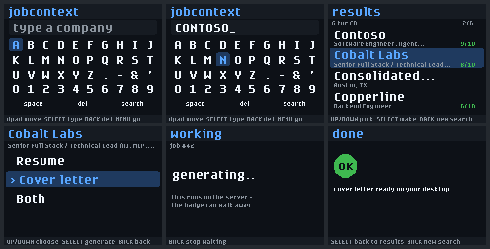

# jobcontext on the GitHub Universe badge

Search your job pipeline and queue tailored materials from the badge on your
lanyard. Type a company you just met, see what your own data says about them,
press a pad, and a resume or cover letter is generated back on the server.



*Rendered by the real Badgeware graphics stack in Pimoroni's simulator — see
[`simulator/`](simulator/). Company names are fictional.*

## The hardware

GitHub Universe **2026** hands out a custom derivative of the **Pimoroni Tufty
2350** ([badge repo](https://github.com/campus-experts/ce-badge-universe26-hack-OFFICIAL)).

| | |
|---|---|
| MCU | RP2350B, 8MB PSRAM, 16MB flash |
| Display | 320×240 LCD (the app runs in `HIRES` mode; the default is 160×120) |
| Wireless | 2.4GHz WiFi + Bluetooth |
| Controls | eight capacitive pads: d-pad, SELECT, BACK, MENU, HOME |
| Other | IMU, IR transmit/receive, ambient light, four case LEDs, Qw/ST |

The pads are logical, not physical: the firmware uses the IMU to keep them
(and the display) the right way round when the badge hangs upside down on
the lanyard, so the app only ever asks for `BUTTON_SELECT`, never "the pad
on the left".

### Before the conference: the 2025 badge or a stock Tufty

The same app runs on a **stock Pimoroni Tufty 2350** or the **Universe 2025
badge** (sold as "Badger 2350 (Hackable Conference Badge)" in the GitHub
shop — despite the name, it is the colour-LCD Tufty board, not the e-ink
Badger). Both have physical buttons instead of pads, and the app detects
that at startup and switches to its buttons mode (see *Using it*).

The 2025 badge ships its 2025 firmware ("MONA-OS"), whose API predates the
one this app targets. Flash Pimoroni's current Tufty 2350 firmware first
([`pimoroni/tufty2350`](https://github.com/pimoroni/tufty2350) releases): the
`.uf2` copies over in the RP2350's USB bootloader mode. A stock Tufty from
Pimoroni ships on current firmware already.

What a Tufty can and cannot stand in for: it runs the same MCU, screen,
radio and Badgeware runtime, so WiFi to your server, request timeouts,
speed and memory are all real. It has no capacitive pads and no IMU
remapping — those only exist on the 2026 badge.

## Install

1. **Mint a badge-scoped token.** Dashboard → API Keys → scope
   **"Badge only — conference badge"** → Generate. Copy it; it is shown once.

2. **Mount the badge.** Double-press RESET with a USB-C data cable attached;
   it appears as a `BADGER` volume containing `system/apps`.

3. **Configure.** Add two lines to `BADGER/system/secrets.py` — the same file
   that already holds `WIFI_SSID` / `WIFI_PASSWORD` for the built-in apps:

   ```python
   JOBCONTEXT_URL = "https://jobcontext.ai"
   JOBCONTEXT_TOKEN = "jcmcp_..."   # the badge-scoped token from step 1
   ```

4. **Copy the app.**

   ```sh
   cp -r badge/jobcontext /Volumes/BADGER/system/apps/
   ```

   or use the badge repo's `deploy_app.py`, which previews the file list first
   and never copies a `secrets.py`.

5. **Eject, press RESET once**, and pick *jobcontext* from the launcher.

If a setting is missing the app says which one (`add JOBCONTEXT_TOKEN to
secrets.py`) rather than failing to connect.

## Using it

| Screen | d-pad | SELECT | BACK | MENU |
|---|---|---|---|---|
| Search | move the keyboard cursor (hold to repeat) | press the key | delete | search |
| Results | UP/DOWN pick a result | open the actions menu | new search | — |
| Actions | UP/DOWN resume / cover letter / both | generate | back | — |
| Working | — | — | stop waiting (the job keeps running) | — |
| Done / problem | — | back to results / retry | new search | — |

HOME always returns to the launcher; the firmware reserves it.

**On physical buttons** (stock Tufty, 2025 badge):

| Button | Acts as |
|---|---|
| UP / DOWN | UP / DOWN |
| A / C | LEFT / RIGHT |
| B, tapped | SELECT (fires on release) |
| B, held ~0.6s | BACK (fires while held; releasing it does not also select) |

There is no MENU button — use the keyboard's on-screen **search** key. The
footer legend names whichever controls the badge in hand actually has
("B type  hold B del" versus "SELECT type  BACK del").

BACK is a long press on B rather than a chord like A+C because a chord's
first button has already acted by the time the second arrives: the cursor
would jump before "back" registered.

The keyboard is a grid: letters, the punctuation that shows up in company
names (`. - & '`), digits, and a row of **space / del / search** keys. Movement
wraps on both axes — from `A`, `J` is one step left.

## Why the token is scoped

Anyone can mount this badge's filesystem by double-pressing reset and
plugging in a USB-C cable, and `secrets.py` is plain text. A badge-scoped key
can do exactly three things — search, queue a generation, poll that
generation — and is refused everywhere else in the API, including the MCP
surface. Never put a full-access key on a device you wear.

Use guest WiFi if you can, for the same reason.

## How it fits the runtime

The 2026 app contract is: module code runs once, then `run(update)` calls
`update()` every frame and presents what it drew when it returns. Two things
follow from that, and both are tested:

- **Nothing blocks the frame loop by surprise.** WiFi is polled —
  `wifi.connect()` is non-blocking and called every frame until it reports
  connected. Network calls are *deferred*: the frame that starts a search
  draws "searching..." and returns so that frame is actually shown, and the
  call runs at the start of the next one. Drawing a status and then blocking
  in the same `update()` would never display it.
- **Each frame handles input once, then draws once.** The firmware's
  `badge.pressed()` is edge-triggered, and the state machine consumes a press
  in the current screen's input handler before the next screen draws, so the
  SELECT that opens the actions menu cannot also press "generate".

## About Bluetooth keyboards

The original design called for pairing a Bluetooth keyboard to the badge for
fast text entry. That is not implemented, and the reason is structural rather
than incidental: it needs the badge to act as an HID-over-GATT **host**
(scan → connect → discover service `0x1812` → parse the report map →
subscribe to report notifications → hold an encrypted bonded link, because
essentially every keyboard refuses to send reports over an unencrypted one).

Every MicroPython BLE HID library in the wild is the *peripheral* side — code
that lets a board pretend to *be* a keyboard. There is no host stack to drop
in, and MicroPython's pairing/bonding support is build-flag gated, so step one
is confirming the firmware was even compiled with it.

With the 2026 d-pad the grid keyboard is quick enough that this matters less
than it did on the five-button 2025 badge. The app is still built so it can
land without touching the state machine: `inputs.py` defines a source
interface, `best_available()` picks the richest working one, and
`BleKeyboardInput` is wired in and reporting unavailable. Implement
`available()` and `poll()` there and the badge starts using it automatically.

## Layout

```
badge/
  jobcontext/
    __init__.py     app contract (init, update, run) + state machine
    ui.py           drawing + input shim — the ONLY file touching firmware globals
    keyboard.py     on-screen grid keyboard
    inputs.py       pluggable input sources (pads now, BLE later)
    api.py          /api/badge/* client, firmware wifi, root secrets.py
    icon.png        24×24 launcher icon
  simulator/        headless renders through Pimoroni's Badgeware simulator
  screens.png       the renders above
```

## What has and hasn't been verified

- **Host tests** (`tests/test_badge_firmware.py`): the real app modules
  against a fake 2026 runtime — text entry, hold-to-repeat, every screen
  transition, deferred calls, polling cadence, error mapping, and the
  press-leak regression.
- **Simulator** (`simulator/`): every screen rendered by the real Badgeware
  graphics library, and real edge-triggered input driven through it. This is
  where text layout was measured — the `nope` font's line box is 13px at size
  1, not the 8px its name suggests, and an undersized text rect silently cuts
  glyphs off rather than adding an ellipsis.
- **Buttons mode on the real runtime.** The simulator *is* a stock Tufty, so
  it runs the physical-buttons path for real: tap B types on release, a 1.2s
  hold of B is exactly one BACK with nothing typed, A/C move and wrap.
  `CONTROLS=buttons` renders its legends.
- **Not yet on hardware.** The simulator does not model GitHub's capacitive
  pads, IMU remapping or radio. Still to check on a real badge: the pad
  mapping and hold-to-repeat feel on capacitive pads, WiFi on a conference
  network, and the firmware `requests` module's `timeout=`. A Tufty or 2025
  badge covers the last two.
