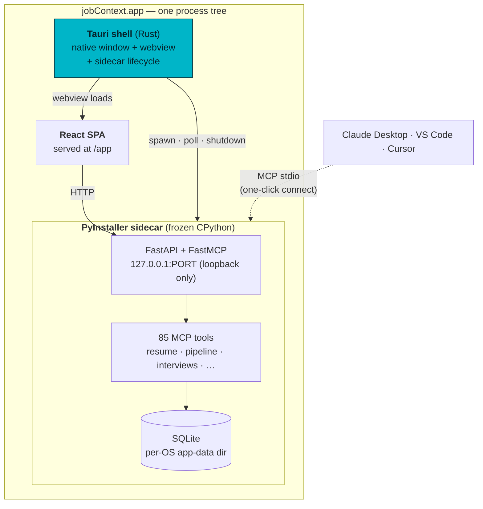
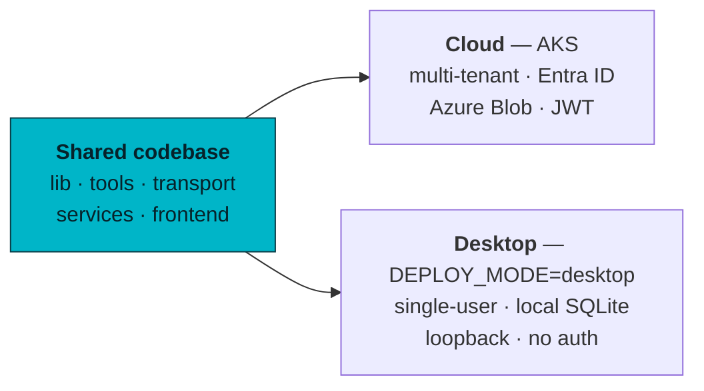
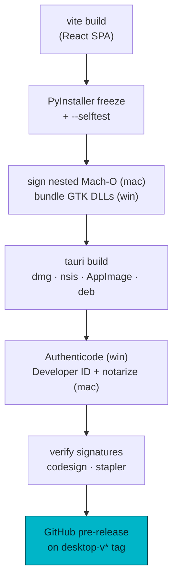

# jobContext Desktop

A double-clickable desktop build of jobContext — the Python MCP server, the
React dashboard, and local SQLite storage bundled into one native app with
zero terminal setup. It's a second distribution channel from the same
codebase as the [AKS cloud product](../README.md); the cloud deployment is
unchanged.

- **macOS** — `.dmg` (Apple Silicon + Intel), Developer ID signed + notarized
- **Windows** — NSIS `.exe` (per-user, no admin), Authenticode signed
- **Linux** — `.AppImage` + `.deb`

> **Download:** grab the latest installer from the
> [Releases page](https://github.com/JustLikeFrank3/jobContextMCP/releases).
> Each release's notes include per-platform install steps.

The stack is a **Tauri 2 shell** (Rust, ~10 MB) that renders the existing
React SPA in the OS's native webview and manages a **PyInstaller-frozen
Python backend** as a sidecar process. No Electron, no bundled Chromium.

---

## Architecture

The whole app is one process tree: a thin native shell that owns the window,
and a frozen Python backend it spawns and supervises. The webview talks to
that backend over loopback HTTP — the same FastAPI/FastMCP server the cloud
product runs, just in single-user `DEPLOY_MODE=desktop`.



**Why a sidecar, not a rewrite:** the backend is 85 tools, WeasyPrint PDF
rendering, LangGraph, and 1,300+ tests of Python. Freezing it with
PyInstaller and shipping it as a managed subprocess reuses all of it verbatim
— the desktop app and the cloud app run byte-identical server code.

### Local-first data

Everything mutable lives in the per-OS app-data directory — nothing is
written next to the (read-only) installed app:

| OS | App-data location |
|----|-------------------|
| macOS | `~/Library/Application Support/jobContext` |
| Windows | `%APPDATA%\jobContext` |
| Linux | `~/.local/share/jobContext` (respects `XDG_DATA_HOME`) |

On first launch the backend provisions this dir — SQLite DB with the full
schema, the workspace folder tree, and a starter config — reusing the same
`provision_user_data()` path the cloud product uses for a new tenant. The
desktop is simply the degenerate single-tenant case: no Entra, no Azure Blob,
no auth; loopback bind only.

---

## Startup & lifecycle

The shell and backend agree on a small, stable contract. The shell spawns the
sidecar on an OS-assigned free port, learns the port from stdout, waits for
health, then points the webview at the dashboard.

```mermaid
sequenceDiagram
    actor U as User
    participant S as Tauri shell
    participant B as Sidecar (Python)
    U->>S: launch app
    S->>B: spawn (127.0.0.1:0, stdin pipe held)
    B-->>S: stdout "JOBCONTEXT_PORT=&lt;port&gt;"
    loop until 200 (≤30s)
        S->>B: GET /healthz
    end
    B-->>S: 200 ok
    S->>S: navigate webview → /app
    Note over U,B: user works — SPA ⇄ HTTP ⇄ SQLite
    U->>S: close window
    S->>B: POST /desktop/shutdown
    B-->>S: graceful exit
```

**No orphaned backends.** Three independent guarantees prevent the classic
"backend keeps running after the window closes" bug:

1. Window close → `POST /desktop/shutdown` (flips uvicorn's `should_exit`).
2. If the shell is force-killed (SIGKILL, logout, crash) — which fires *no*
   window event — the backend's `--parent-watchdog` exits on **stdin EOF**.
   The shell holds the child's stdin pipe for its whole life, so the OS
   closes it on any parent death.
3. A kill fallback if the graceful path doesn't complete in 5 s.

A **single-instance lock** means relaunching focuses the existing window
instead of spawning a second backend against the same SQLite file.

The exact contract (`src-tauri/src/main.rs`):

1. Spawn the sidecar from the bundle's resource dir (dev fallback:
   `../../dist/jobcontext-backend/`).
2. Parse `JOBCONTEXT_PORT=<port>` from stdout, then keep draining stdout so
   the child never blocks on a full pipe.
3. Poll `GET /healthz` over raw TCP (no extra crates) up to 30 s; the window
   shows `splash/index.html` until then.
4. Navigate the webview to `http://127.0.0.1:<port>/app`.
5. On exit: shutdown → wait → kill.

---

## Two distribution channels, one codebase

Nothing forked. The desktop profile is a runtime mode, selected by
`DEPLOY_MODE=desktop`, that swaps the cloud's multi-tenant/Entra/Blob
machinery for local single-user defaults.



---

## AI in the desktop app

Two complementary surfaces:

- **Bring your own Claude (MCP).** Settings → "AI clients (MCP)" writes the
  MCP config for Claude Desktop / VS Code / Cursor with one click, pointing
  them at the installed binary (`--mcp-stdio`). Your chat client gains all the
  job-search tools, grounded in your local data.
- **Embedded chat.** A built-in chat panel runs an agent loop over a curated
  subset of the tools, BYOK across OpenAI / Anthropic / Ollama / Azure —
  configured in Settings, key stored locally.

---

## Build & release pipeline

CI (`.github/workflows/desktop-build.yml`) builds all four platforms from the
same reusable workflow, used by both branch CI and tag releases.



**Signing is guarded on secrets** — forks and secretless runs still produce
(unsigned) installers. macOS notarization requires every Mach-O in the frozen
sidecar (~90 dylibs + the exe) to be individually Developer ID signed with the
hardened runtime, not just the app — CI does that before Tauri wraps the
bundle, then a verify gate (`codesign --deep --strict` + `stapler validate`)
fails the build rather than the tester's Gatekeeper.

**Cutting a release:**

```bash
git tag desktop-v1.0.0-beta.2
git push origin desktop-v1.0.0-beta.2
```

The `desktop-v*` tag namespace is disjoint from the cloud product's `v*` tags,
so desktop betas never appear as `/releases/latest` for MCP-connector users.

---

## Local development

### Prerequisites

- **Rust** — `curl --proto '=https' --tlsv1.2 -sSf https://sh.rustup.rs | sh`
- **Node 20+** (already required for the SPA)
- **Python 3.12** + `pip install -r ../requirements-dev.txt`
- Linux only: `libwebkit2gtk-4.1-dev`, `libappindicator3-dev`, `patchelf`,
  `librsvg2-dev` (see Tauri 2 prerequisites)

### Run in dev

```bash
# 1. Build the SPA (bundled into the backend, served at /app)
cd frontend && npm ci && npm run build && cd ..

# 2. Freeze the backend sidecar (repo root)
pyinstaller packaging/pyinstaller/jobcontext-backend.spec --noconfirm
dist/jobcontext-backend/jobcontext-backend --selftest   # must print SELFTEST PASS

# 3. Run the shell — in dev it finds the sidecar at ../dist automatically
cd desktop && npm install
npm run icon    # once: generates src-tauri/icons/ from icon-source.png
npm run dev
```

### Bundle installers locally

`tauri.conf.json` bundles `src-tauri/binaries/jobcontext-backend/` as a
resource **directory** (a onedir sidecar can't use Tauri's `externalBin`,
which expects single files). Stage the frozen backend in first:

```bash
mkdir -p desktop/src-tauri/binaries
cp -R dist/jobcontext-backend desktop/src-tauri/binaries/
cd desktop && npm run build
```

Unsigned locally unless the Apple/Azure signing env vars are set — the CI
pipeline handles signing + notarization.

---

## Layout

```
desktop/
├── package.json              # Tauri CLI wrapper (dev / build / icon)
├── icon-source.png           # 512² brand mark → src-tauri/icons/
├── splash/index.html         # shown while the backend boots
└── src-tauri/
    ├── Cargo.toml            # Rust deps (tauri, single-instance plugin)
    ├── tauri.conf.json       # bundle targets, resources, macOS entitlements
    ├── entitlements.plist    # hardened-runtime exceptions for frozen CPython
    ├── src/main.rs           # shell: spawn · poll · navigate · shutdown
    └── capabilities/         # Tauri permission scopes

# elsewhere in the repo:
desktop_main.py               # sidecar entrypoint (PyInstaller target)
packaging/pyinstaller/        # freeze spec + hooks + rthooks
docs/desktop/ROADMAP.md       # phase-by-phase plan & decision log
```

See [docs/desktop/ROADMAP.md](../docs/desktop/ROADMAP.md) for the full build
history, the macOS dylib-packaging deep dive, and remaining work.
